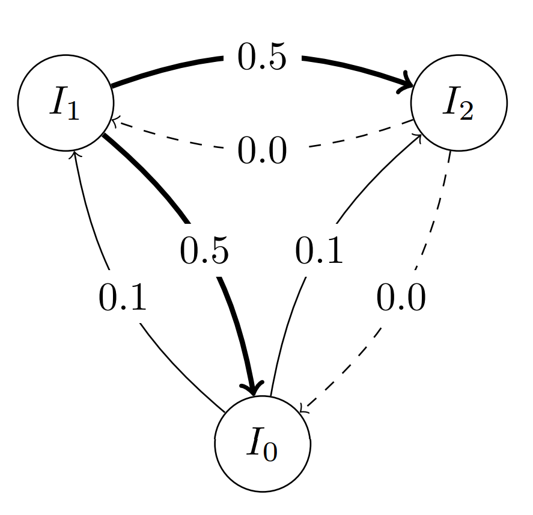
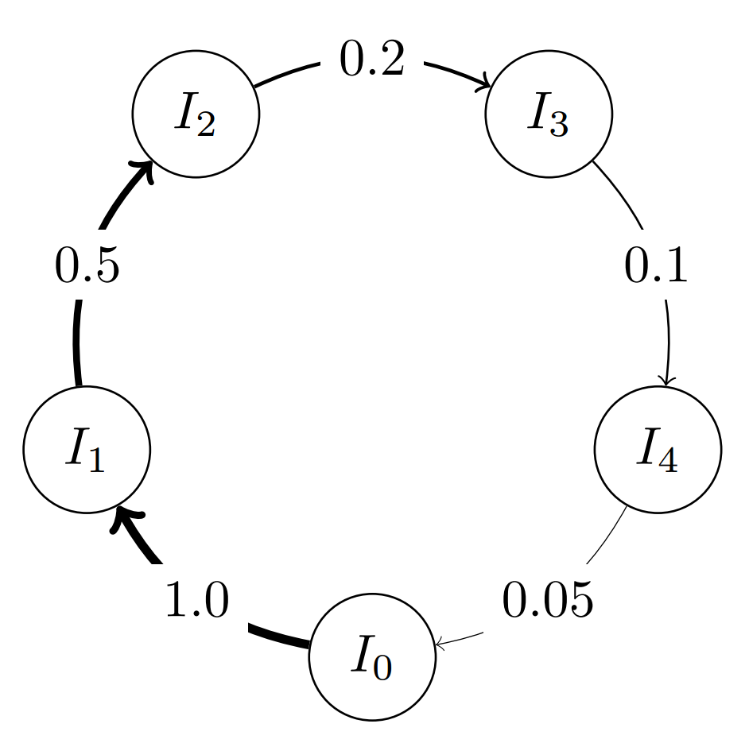

Topology 
=========

The classes of this submodule are all instances of the same base class used to define the migration paths in the
:class:`PyGMO.archipelago`. When a new :class:`PyGMO.island` is pushed back into 
the :class:`PyGMO.archipelago` the various connections are rewired as to respect the topological properties defined 
by these  classes.

The user will mainly use these classes in the following way:

.. code-block:: python

  from PyGMO import *
  prob = problem.lennard_jones(5)
  algo = algorithm.bee_colony(gen = 10) #instantiates artificial bee colony setting 10 generations for each algorithmic call
  topo = topology.ring() #defines an empty ring topology
  archi = archipelago(algo,prob,8,20,topology=topo) #connects 8 islands in a ring topology
  archi.topology.draw() #requires networkx to be installed

Migration Probability
^^^^^^^^^^^^^^^^^^^^^
When defining the migration paths (edges of the DAG in the topology), one of the parameters is the migration probability, by default equal to 1. It is possible to change it globally for all edges:

.. code-block:: python

  from PyGMO import *
  topo = topology.fully_connected(5) # Defines a 5-vertex ring topology
  topo.set_weight(0.5)  # Changing the migration probability to 0.5 for all edges

specify a custom migration probability for all out-going edges of a node:

.. code-block:: python

  from PyGMO import *
  topo = topology.fully_connected(3)  # Defines a 5-vertex ring topology
  topo.set_weight(0.5)  # Change the migration probability to 0.5 for all edges
  topo.set_weight(0, 0.1)  # Probability 0.1 for all out-going edges from island 0
  topo.set_weight(2, 0.0)  # Probability 0.0 for all out-going edges from island 2 (effectively invalidating the migration path)

  
or specify a custom migration probability for individual edges:

.. code-block:: python

  from PyGMO import *
  topo = topology.one_way_ring(5)  # Defines a 5-vertex ring topology
  topo.set_weight(1, 2, 0.5)  # Changing the migration probability to 0.5 for edge 1 -> 2
  topo.set_weight(2, 3, 0.2)  # Changing the migration probability to 0.2 for edge 2 -> 3
  topo.set_weight(3, 4, 0.1)  # Changing the migration probability to 0.1 for edge 3 -> 4
  topo.set_weight(4, 0, 0.05)  # Changing the migration probability to 0.05 for edge 4 -> 0

The Classes
-----------

.. class:: PyGMO.topology.base()

   Methods of the topology base class, shared by all topology objects.

   .. method:: PyGMO.topology.base.set_weight((float)w)

      Sets the weight for each edge in the topology.

   .. method:: PyGMO.topology.base.set_weight((int)id, (float)w)

      Sets the weight for each edge outgoing from the vertex id

   .. method:: PyGMO.topology.base.set_weight((int)id1, (int)id2, (float)w)

      Sets the weight for the edge between the vertices id1 and id2

.. class:: PyGMO.topology.unconnected()

   Unconnected topology (this corresponds to do parallel independent runs of the algorithms)

   .. automethod:: PyGMO.topology.unconnected.__init__
  
   .. automethod:: PyGMO.topology.unconnected.draw()

   .. image:: ../images/topos/unconnected.png

   The above image is produced by the code:

   .. code-block:: python

      from PyGMO import *
      topo = topology.unconnected(nodes=100)
      topo.draw(layout='spring', n_size=15, e_arrows=False)

.. class:: PyGMO.topology.ring()

   Ring topology (links go in both directions)

   .. automethod:: PyGMO.topology.ring.__init__
  
   .. automethod:: PyGMO.topology.ring.draw()

   .. image:: ../images/topos/ring.png

   The above image is produced by the code:

   .. code-block:: python

      from PyGMO import *
      topo = topology.ring(nodes=30)
      topo.draw(layout='circular', n_size=30, e_arrows=True, e_alpha=0.5)

.. class:: PyGMO.topology.one_way_ring()

   Ring topology (links go only in one direction)

   .. automethod:: PyGMO.topology.one_way_ring.__init__

   .. automethod:: PyGMO.topology.one_way_ring.draw()

   .. image:: ../images/topos/one_way_ring.png

   The above image is produced by the code:

   .. code-block:: python

      from PyGMO import *
      topo = topology.one_way_ring(nodes=30)
      topo.draw(layout='circular', n_size=30, e_arrows=True, e_alpha=0.5)

.. class:: PyGMO.topology.fully_connected()

   Fully connected topology (i.e. all islands are connected bi-directionally)

   .. automethod:: PyGMO.topology.fully_connected.__init__

   .. automethod:: PyGMO.topology.fully_connected.draw()

   .. image:: ../images/topos/fully_connected.png

   The above image is produced by the code:

   .. code-block:: python

      from PyGMO import *
      topo = topology.fully_connected(nodes=30)
      topo.draw(layout='circular', n_size=30, e_arrows=True, e_alpha=0.1)

.. class:: PyGMO.topology.pan

   Islands are connected in a ring, except the island with id 0 that is connected to the ring only receiving migrants. This
   topology was first conceived to have global optimization happening on the outer ring while using a local optimizer
   in the island 0 to refine the solution (also seen as a memetic approach)

   .. automethod:: PyGMO.topology.pan.__init__

   .. automethod:: PyGMO.topology.pan.draw()

   .. image:: ../images/topos/pan.png

   .. code-block:: python

      from PyGMO import *
      topo = topology.pan(nodes=10)
      topo.draw(layout='spring', n_size=30, e_arrows = True)

.. class:: PyGMO.topology.rim

   Islands are connected in a ring and they all are also connected to the No.0 island.

   .. automethod:: PyGMO.topology.rim.__init__

   .. automethod:: PyGMO.topology.rim.draw()

   .. image:: ../images/topos/rim.png

   .. code-block:: python

      from PyGMO import *
      topo = topology.rim(nodes=90)
      topo.draw(layout='circular', n_size=30)

.. class:: PyGMO.topology.hypercube()

   Hypercube topology

   .. automethod:: PyGMO.topology.hypercube.__init__

   .. automethod:: PyGMO.topology.hypercube.draw()

   .. image:: ../images/topos/hypercube.png

   .. code-block:: python

      from PyGMO import *
      topo = topology.hypercube(nodes=32)
      topo.draw(layout='spring', n_size=90)

.. class:: PyGMO.topology.watts_strogatz

   The Watts-Strogatz topology is a ring lattice network in which forward
   edges are rewired with random probability. Such a network has small-world properties, 
   including short average path
   lengths and high clustering. When the push_back method is used all the connections 
   are rewired (all links are bidirectional).

   `Watts-Strogatz topology in wikipedia <http://en.wikipedia.org/wiki/Watts_and_Strogatz_model>`_

   .. automethod:: PyGMO.topology.watts_strogatz.__init__

   .. automethod:: PyGMO.topology.watts_strogatz.draw()

   .. image:: ../images/topos/watts_strogatz.png

   The above image is produced by the code:

   .. code-block:: python

      from PyGMO import *
      topo = topology.watts_strogatz(nodes=100, p=0.1)
      topo.draw(layout='circular', n_size=3, scale_by_degree=True)

.. class:: PyGMO.topology.erdos_renyi

   A random graph (all links are bidirectional)

   .. automethod:: PyGMO.topology.erdos_renyi.__init__

   .. automethod:: PyGMO.topology.erdos_renyi.draw()

   .. image:: ../images/topos/random.png

   The above image is produced by the code:

   .. code-block:: python

      from PyGMO import *
      topo = topology.erdos_renyi(nodes=100, p=0.03)
      topo.draw(layout='spring', n_size=5, scale_by_degree=True)

.. class:: PyGMO.topology.barabasi_albert

   Topology based on the Barabási-Albert (BA) model. (all links are bidirectional)

   The network is grown in two phases:

      * The first m0 elements added to the network constitute a kernel of nodes connected to each other
        with high probability;
 
      * After the kernel is built, the next elements added to the network
        are connected randomly to m of the existing nodes; the probability of connection 
        is biased linearly towards the most connected nodes.

   .. automethod:: PyGMO.topology.barabasi_albert.__init__

   .. automethod:: PyGMO.topology.barabasi_albert.draw()

   .. image:: ../images/topos/ba.png

   The above image is produced by the code:

   .. code-block:: python

      from PyGMO import *
      topo = topology.barabasi_albert(m0=3, m=3, nodes=1000)
      topo.draw(layout='spring', n_size=1, scale_by_degree=True,e_alpha=0.03)

.. class:: PyGMO.topology.clustered_ba

   Topology based on the Clustered Barabási-Albert (BA) model. (all links are bidirectional)

   The network is grown in two phases:

      * The first m0 elements added to the network constitute a kernel of nodes connected to each other
        with high probability;
 
      * After the kernel is built, the next elements added to the network
        are connected randomly to m of the existing nodes; the probability of connection 
        is biased linearly towards the most connected nodes. *A link is established also between 
        the m nodes with probability p*

   .. automethod:: PyGMO.topology.clustered_ba.__init__

   .. automethod:: PyGMO.topology.clustered_ba.draw()

   .. image:: ../images/topos/clustered_ba.png

   The above image is produced by the code:

   .. code-block:: python

      from PyGMO import *
      topo = topology.clustered_ba(m0=3, m=3, p=0.5,nodes=1000)
      topo.draw(layout='spring', n_size=1, scale_by_degree=True,e_alpha=0.03)

.. class:: PyGMO.topology.ageing_clustered_ba

   Topology based on the Ageing Clustered Barabási-Albert (BA) model. (all links are bidirectional)

   The network is grown in two phases:

      * The first m0 elements added to the network constitute a kernel of nodes connected to each other
        with high probability;
 
      * After the kernel is built, the next elements added to the network
        are connected randomly to m of the existing nodes *not older than a*; the probability of connection 
        is biased linearly towards the most connected nodes. A link is established also between 
        the m nodes with probability p

   .. automethod:: PyGMO.topology.ageing_clustered_ba.__init__

   .. automethod:: PyGMO.topology.ageing_clustered_ba.draw()

   .. image:: ../images/topos/ageing_clustered_ba.png

   The above image is produced by the code:

   .. code-block:: python

      from PyGMO import *
      topo = topology.ageing_clustered_ba(m0=3, m=3, p=0.5,a=150,nodes=1000)
      topo.draw(layout='spring', n_size=1, scale_by_degree=True,e_alpha=0.03)

.. class:: PyGMO.topology.custom()

   A custom topology. Allows for the construction of any topology via its unique methods.

   .. method:: PyGMO.topology.custom.push_back()
    
      Adds a vertex

   .. method:: PyGMO.topology.custom.add_edge((int)id1, (int)id2, (float)w)

      Adds a directed adge from vertex id1 to vertex id2, with an optional weight 'w' between id1 and id2 (by default 1.0)

   .. method:: PyGMO.topology.custom.remove_edge((int)id1, (int)id2)

      Removes the directed adge from vertex id1 to vertex id2

   .. method:: PyGMO.topology.custom.remove_all_edges()

      Removes all_edges

   .. method:: PyGMO.topology.custom.draw()

      Uses Python networx module to draw the topology in a graphic window

   Example: 

   .. code-block:: python

      from PyGMO import *
      prob = problem.lennard_jones(5)
      algo = algorithm.de(gen = 10)     #instantiates artificial bee colony with default params and 10 generations
      topo = topology.custom()    #builds a custom topology
      for i in range(30):
           topo.push_back()       #Now we have an unconnected topology of 30 vertices
      topo.add_edge(1,2)
      ....
      topo.add_edge(22,0)
      archi = archipelago(algo,prob,30,20) #constructs an archipelago (we cannot assign here directly topo 
                                           #to the kwarg topology as the archipelago constructor only takes empty topologies
      archi.topology = topo                #sets the topology to the customly constructed one
      archi.topology.draw()                #Draws the topology (this requires networkx to be installed)
