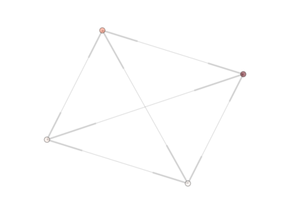

A study on Mixing Variants of Differential Evolution
====================================================

Several studies made in the decade 2000-2010 pointed towards a sharp
benefit in the concurrent use of several different variants of the Differential-Evolution
algorithm. In this example we show how PyGMO can be used to study this idea. Consider the code

.. code-block:: python

   from PyGMO import *
   prob = problem.messenger_full()
   de_variants = [2,3,5,7]
   algos = [algorithm.de(gen=50,variant=v) for v in de_variants]
   archi = archipelago(topology=topology.fully_connected())
   for algo in algos:
   	archi.push_back(island(algo,prob,25)) 
   

The :class:`PyGMO.archipelago.draw()` method creates the figure shown below.

Where four islands are shown and color coded with respect to their randomly initialized population fitness.
Each island is interconnected bi-directionally to all others as we used a :class:`PyGMO.topology.fully_connected()` topology.
In an IPyhon session we could call the draw method interactively and also print the algorithms to screen to see their exact details.

.. code-block:: python

   In [71]: pos = archi.draw(n_size=100,e_arrows=True)
   In [72]: algos
   Out[72]: 
   [Algorithm name: Differential Evolution - gen:50 F: 0.8 CR: 0.9 variant:2,
    Algorithm name: Differential Evolution - gen:50 F: 0.8 CR: 0.9 variant:3,
    Algorithm name: Differential Evolution - gen:50 F: 0.8 CR: 0.9 variant:5,
    Algorithm name: Differential Evolution - gen:50 F: 0.8 CR: 0.9 variant:7]

the values of F anf CR have been set to the default values when the algorithms were constructed.

Now that the archipelago is built we want to study its performance over, say, maximum 150,000 function evaluations.
We can do this by calling the :class:`PyGMO.archipelago.evolve(30)` method and showing, at the end the fitness of the best individual of 
the archipeago. The total number of function evaluations will be, at most, 30 * 4 * 25 * 50 (n_evolvw * n_island * n_individuals * n_generations) = 150,000. It could actually be less if other exit criteria, than the maximim number of generation/iteration is reached, is met before. The remaining code is, then;

.. code-block:: python

   archi.evolve(30)
   print min([isl.population.champion.f[0] for isl in archi])

As to accumulate statistical significance on the archipelago performance, we repeat the process 
and return the mean, median, best and worst. 
The final script (included in PyGMO) is:

.. code-block:: python

   def example_1(n_trials=25, variant_adptv=2, memory=True):
	from PyGMO import problem, algorithm, island, archipelago
	from PyGMO.topology import fully_connected
	from numpy import mean, median
	results = list()
	prob = problem.messenger_full()
	de_variants = [11,13,15,17]
	algos = [algorithm.jde(gen=50,variant=v, memory=memory, variant_adptv=variant_adptv) for v in de_variants]
	
	for trial in range(n_trials):
		archi = archipelago(topology=fully_connected())
		for algo in algos:
			archi.push_back(island(algo,prob,25)) 
		print "Trial N: " + str(trial)
		archi.evolve(30)
		results.append(min([isl.population.champion.f[0] for isl in archi]))
	return (mean(results), median(results), min(results), max(results))

where we used the self-adaptive version of DE. The typical result will be ....

.. code-block:: python

   out[6]: (12.998491561914381, 12.842732158775831, 7.883450738472785, 18.493477879276586)

In case you find a better mean or min with another archipelago after 150,000 function evaluations (and 30 trials) ... send us your PyGMO code!!

