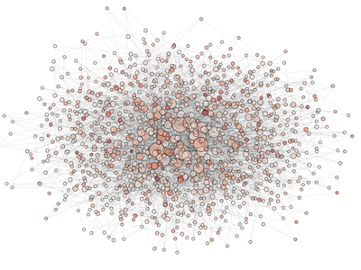
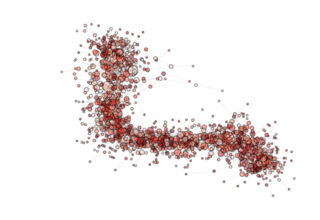

Monitoring the Information Flow in a large archipelago
======================================================

NOTE: For this example you need at least networkx 1.8! If you are still using networkx 1.7, the
maximum amount of islands you can draw in the spring layout is limited by 499 due to some bug in that library.

The effect of the generalized migration operator on the optimization process
is complex. Here we show how to use PyGMO to visualize and study it on a fairly large archipelago.

.. code-block:: python

   from PyGMO import *
   prob = problem.rosenbrock(dim = 10)
   algo = algorithm.de(gen = 1)
   archi = archipelago(algo,prob,1024,20,topology=topology.barabasi_albert(3,3))
   pos = archi.draw(scale_by_degree=True,n_size=1,e_alpha=0.03)
   savefig('archi000', dpi = 72)

In the above code we instantiate the archipelago and visualize it, color coding the nodes with the champion's
fitness in the archipelago. We then save the figure in the current directory. The figure will look something like ...

We then evolve 200 times producing, at each step, the picture of the archipealgo with the new evolved 
fitness

.. code-block:: python

   for i in range(1,200):
	archi.evolve(1); 
	archi.join();
	pos = archi.draw(scale_by_degree=True,n_size=3,e_alpha=0.03)
	savefig('archi%03d' % i, dpi = 72);  
	close()

Putting together the frames produced (in a linux system one can use imagemagik
and the simple command 

.. code-block:: bash

   convert archi* movie.gif

we obtain the animated gif  ...

.. image:: ../images/examples/ex2_mov_ba_fit.gif

NOTE: see how, in the particular archipealgo considered, the optimization proceeds in a *centripetal*
fashion, that is from the 'suburbs' to the center. This allows us to learn that highly connected nodes
(the hubs) are always behind in the optimization process as, probably, they receive **too much information**.
This is a characteristic of the Barabasi Albert topology. Other topologies have different dynamics.
If, for example, we were to use an ageing_clusterd_ba topology the movie below would be produced ...

Showing an entirely different dynamics of the optimization.

The final script (included in PyGMO) is:

.. code-block:: python

   def example_2(algo=algorithm.de(1), prob = problem.rosenbrock(10), topo = topology.barabasi_albert(3,3), n_evolve = 100, n_isl = 1024, pop_size = 20, color_code='rank'):
	from PyGMO import problem, algorithm, island, archipelago
	from matplotlib.pyplot import savefig, close
	archi = archipelago(algo,prob,n_isl,pop_size,topology=topo)
	print "Drawing Initial Condition .. "
	pos = archi.draw(scale_by_degree=True,n_size=3,e_alpha=0.03, n_color = color_code)
	savefig('archi000', dpi = 72)
	close()
	for i in range(1,n_evolve):
		archi.evolve(1); 
		archi.join();
		print "Drawing"+ str(i) +  "-th evolution .. "
		pos = archi.draw(layout = pos, scale_by_degree=True,n_size=3,e_alpha=0.03, n_color = color_code)
		savefig('archi%03d' % i, dpi = 72);  
		close()

