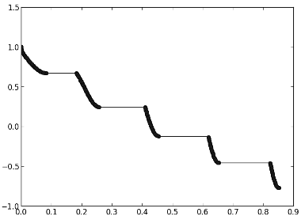
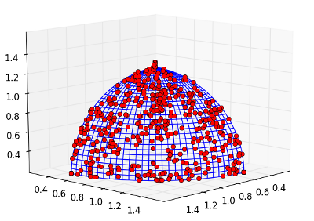

Multi-objective optimization in the asynchronous island model
=============================================================

PyGMO can be used to optimize problems with more than one objective. While
the general workflow is similar to single-objective optimization, there
are some more features like plotting that can be used to analyse the process. 
In order to plot, start an ipython-shell with matplotlib activated:
	
.. code-block:: bash
    
    ipython --pylab

Let us now initialize a multi-objective problem of the ZDT test suite and solve
it with an multi-objective optimization algorithm.

.. code-block:: python

    from PyGMO import *
    prob = problem.zdt(3)
    alg = algorithm.nsga_II(gen = 1)
    pop = population(prob, 200)
    for i in xrange(200):
        pop = alg.evolve(pop)
    pop.plot_pareto_fronts()

The last call draws you a nice plot of the population and the obtained Pareto-front
and is especially useful for problems with two objectives.

You can also investigate a list of the non-dominated fronts the algorithm produces by using
the following command. In this example it should give you just one front back, since all
individuals are non-dominated by now.

.. code-block:: python

	pop.compute_pareto_fronts()

Try this command on a newly initialized population and you will see different non-dominated
fronts, ordered from first to the last.

Of course, you can also use the whole power of the underlying asynchronous island model
of PyGMO to optimize your problems. Let us solve a problem with three objective with
the help of an archipelago, consisting of 16 islands, each containing just 32 individuals.

.. code-block:: python

    prob = problem.dtlz(3)
    alg = algorithm.nsga_II(gen = 1)
    s_pol = migration.best_s_policy(0.1, migration.rate_type.fractional)
    r_pol = migration.fair_r_policy(0.1, migration.rate_type.fractional)
    archi = archipelago(topology=topology.fully_connected())
    isls = [island(alg, prob, 32, s_policy=s_pol, r_policy=r_pol) for i in xrange(16)]
    for isl in isls:
        archi.push_back(isl)
   
In this setting, we migrate the 10% best individuals of each island and replace 10% of the old population 
(if the new migrants are not worse). However, the meaning of "best" and "worst" is different compared to 
single-objective optimization. PyGMO is using the crowded comparison operator
internally to order all individuals in a multi-objective population. This ordering favours at first members with
low non-domination ranks and, if individuals belong to the same front, members with the highest
crowding distance (thus individuals in sparsely populated areas of the fitness space). Thus,
there is a notion of a champion for PyGMO in the multi-objective setting: it is the individual with
the best non-domination rank (being in the non-dominated front) with the highest crowding distance.
The following command gives us the best 3 individuals of every island in the archipelago

.. code-block:: python

    for isl in archi:
        print isl.population.get_best_idx(3)

For a single individual of a population we can also query by how many individuals it is dominated (domination
count) and which individuals it dominates by itself (domination list):

.. code-block:: python

    [archi[0].population.get_domination_list(i) for i in xrange(32)]
    [archi[0].population.get_domination_count(i) for i in xrange(32)]

Lets evolve the archipelago for 500 generations.
	
.. code-block:: python

     for i in xrange(500):
          archi.evolve(1)

We will now create a new population that consists of all the individuals of the archipelago. Since the
plotting-function of the population itself is limited to 2D-plotting, we will use the plotting function
of the problem itself, which provides a 3D plot with the actual Pareto-front highlighted blue.

.. code-block:: python

    pop = population(prob)
    for isl in archi:
        for ind in isl.population:
            pop.push_back(ind.cur_x)
    prob.plot(pop)
    

    
Obtaining the same amount of solutions (which is 512 in this example) takes significantly more time if one uses just
a single, large population. Moreover, there is evidence that migration in multi-objective optimization helps to
reduce the number of generations needed and helps algorithms to better explore the whole Pareto-front.
