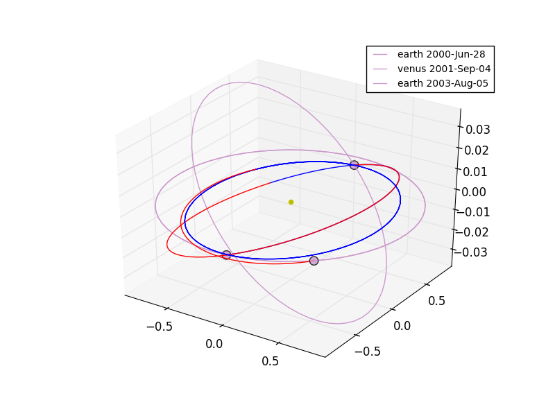

Designing and optimizing interplanetary trajectories
====================================================

PyGMO can be used to optimize spacecraft trajectories by using the MGA-1DSM
problem. An instance of this problem contains the sequence of planets, you want to visit
with your spacecraft as well as its launch window, its starting velocity and bounds for the time of flight.
Between each planetary encounters, a deep space manouver can be performed. The objective
is to lower the total Delta-V spend for the travel, as this corresponds directly
to the mass of fuel needed.

**NOTE:** Even though this example will work with PyGMO, you need to install `PyKEP <http://keptoolbox.sourceforge.net/>`_
in order to use other values than the default.

Lets launch PyGMO and start by creating the default problem:

.. code-block:: bash
    
    ipython --pylab

.. code-block:: python

    from PyGMO import *
    alg = algorithm.jde(memory=True)
    prob = problem.mga_1dsm_tof()
    
By default the sequence is Earth - Venus - Earth, so there are two "legs" (1. Earth to Venus and 2. Venus to Earth) to optimize 
at the same time. By default we give a minimum of 50 and a maximum of 900 days to each leg. If you don't believe this, check for yourself:

.. code-block:: python

    prob.get_sequence()
    prob.get_tof()

There are also default values for the other parameters, but you don't have to worry about those details. This version of the problem mga_1dsm_tof (see: :class:`PyGMO.problem.mga_1dsm_tof`)
is particularly useful if you know some bounds on the travel time for your legs. If you have no clue though, you can use the problem mga_1dsm_alpha (see: :class:`PyGMO.problem.mga_1dsm_alpha`)
instead where you can specify just the bounds for the overall time of flight with the tof keyword. 
The alpha-version is also particularly useful for multi-objective optimization. By using the multi_objective keyword as an argument
you can instantiate the problem with two objectives (Delta-V and total time of flight) instead of just one (Delta-V).

.. code-block:: python

    # initialize the trajectory problem to design a tour within 1 to 5 years
    prob_alpha = problem.mga_1dsm_alpha(tof=[1 * 365.25, 5 * 365.25], multi_objective=True)

For the remainder of this example, lets return to the original single-objective problem and start some optimizations runs:

.. code-block:: python

    l = list()
    for i in range(30):
        archi = archipelago(alg,prob,8,10,topology = topology.fully_connected())
        for j in range(30):
            archi.evolve(5)
            print min([isl.population.champion.f[0] for isl in archi])
        tmp = [isl for isl in archi]; tmp.sort(key = lambda x: x.population.champion.f[0]); 
        l.append(tmp[0].population.champion)
    print "Results: \n"  
    print [ch.f[0] for ch in l]
    
We may then plot the trajectory and look at some additional informations:

.. code-block:: python

    # sort list and extract chromosome of the solution of lowest Delta-V
    l.sort(key = lambda x: x.f[0])
    x_so = l[0].x
    prob.plot(x_so)
    print prob.pretty(x_so)
    

That looks nice! Now we are interested in a trade-off between the Delta-V and the the total time of travel. We will use this solution (x_so)
of a low Delta-V and inject it into a new population. This will help when we optimize the population by a multi-objective optimizer for 
low Delta-V and short time of travel at the same time, building up an approximation of the Pareto-front. For this, we reinitialize the problem to be
multi-objective and change the algorithm.

.. code-block:: python

    alg = algorithm.nsga_II()
    prob = problem.mga_1dsm_tof(multi_objective=True)
    
We will use the island model to improve the overall optimization. Each island works just on a small fraction of solutions and
is thus faster as when operating on a single large population.

.. code-block:: python

    sel = migration.best_s_policy(10)
    rep = migration.fair_r_policy(10)
    archi = archipelago(topology = topology.fully_connected())
    pop = population(prob,39)
    # we inject the solution of the single-objective optimization here to get a population of 100
    pop.push_back(x_so)
    isl = island(alg,pop,s_policy=sel, r_policy=rep)
    archi.push_back(isl)
    # we fill up the archipelago with 9 other island initialized by random without injection
    for i in range(9):
        archi.push_back(island(alg,prob,40,s_policy=sel, r_policy=rep))
    archi.evolve(40)
    archi.join()

The injected solution will spread by migration to all other islands in the archipelago. After enough generations,
all islands should have converged to similar fronts. Lets put them all together in a single population and have a 
look at the Pareto-front:

.. code-block:: python

    pop = population(prob)
    for isl in archi:
        for ind in isl.population:
            pop.push_back(ind.cur_x)
    pop.plot_pareto_fronts()
    # highlight the solutions of the 1st island with red
    archi[0].population.plot_pareto_fronts(rgb=(1,0,0))
    ylabel('total travelling time in days')
    xlabel('total Delta-V in m/s')

.. image:: ../images/examples/ex5_pareto.png

You see a discontinuity in this picture which is very interesting: It allows you to save over a year of travelling time by 
just using a bit more Delta-V around 4709 m/s.
