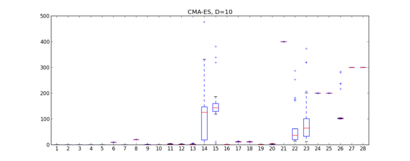
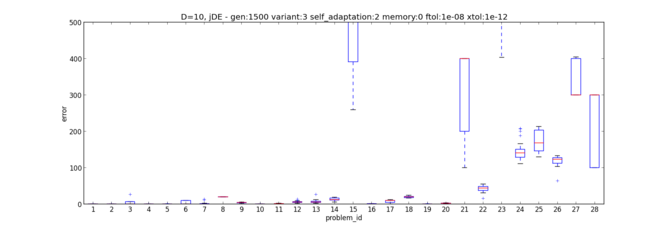
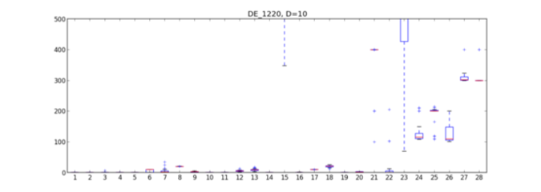

Participating to the CEC2013 Competition (v 1.1.5)
==================================================

In this example we will show how to use PaGMO to test algorithms on the
`test problem suite <http://www.ntu.edu.sg/home/EPNSugan/index_files/CEC2013/CEC2013.htm>`_ used in the
Special Session & Competition on Real-Parameter Single Objective Optimization at CEC-2013, Cancun, Mexico 21-23 June 2013

The first thing to do is to download the text files defining the 28 problems of the CEC2013 competition. These
can be found in `this zip file <http://web.mysites.ntu.edu.sg/epnsugan/PublicSite/Shared%20Documents/CEC2013/cec13-c-code.zip>`_
in the folder called input_files. We will assume, in the rest of this tutorial, that you have put these
files in the directory ~/Documents/input_files/.

Let us start with trying out for problem dimension D=2 the algorithm CMA-ES. As the competition rules
allow D * 10000 function evaluation, we choose a population of 50 with 400 generations.

.. code-block:: python

	from PyGMO import * 
	dir = "/home/my_user/Documents/input_data/"
	algo = algorithm.cmaes(500,xtol=1e-9,ftol=1e-9)
	D = 2
	error = []
	for i in range(28):
		prob = problem.cec2013(dim=D, prob_id=i+1,path=dir)
		pop = population(prob,60)
		pop = algo.evolve(pop)
		error.append(pop.champion.f[0] + 1400 - 100*i - 100*(i>13))
	print error

Note the strange definition of the error which is due to the shift in the objective function value that has been 
defined for the CEC 2013 problems. 

The list error now contains the error made by CMA-ES in solving each one of the 28 test problems. One can loop on
this procedure (say 25 times) and produce the box plots with the following command:

.. code-block:: python

	boxplot([error[s::28] for s in range(28)])

Which produces the output below.

.. image:: ../images/examples/ex6_cmaes_D_2.png

From the image above we see immediately that the problems from 1 to 20 are significantly easier to solve for CMA-ES than the last eight.

We may now try to do the same with a larger number of dimensions, say D=10. As we can now take advantage of an increased number of
function evaluations (100000), we set up CMA-ES differently (i.e. we use a larger population and more maximum iterations).

.. code-block:: python

	from PyGMO import * 
	dir = "/home/my_user/Documents/input_data/"
	algo = algorithm.cmaes(1000,xtol=1e-9,ftol=1e-9)
	D = 10
	error = []
	for j in range(25):
		for i in range(28):
			prob = problem.cec2013(dim=D, prob_id=i+1,path=dir)
			pop = population(prob,100)
			pop = algo.evolve(pop)
			error.append(pop.champion.f[0] + 1400 - 100*i - 100*(i>13))
	boxplot([error[s::28] for s in range(28)])

Which produces the plot below.

The same can be produced for different algorithms:

