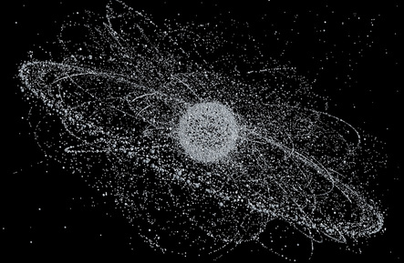
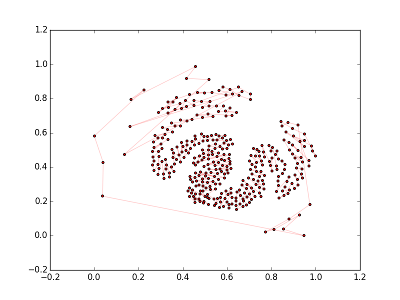
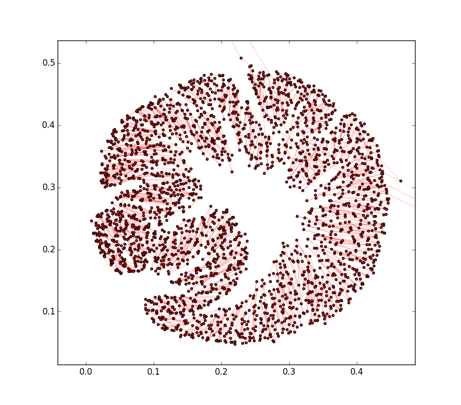

Travelling Salesman Problem for Active Space Debris Removal
===========================================================

The space around our planet is cluttered with huge amount of Space Debris. Space agencies and scientists around the world are aware of the problem and developed concepts and
visions on how the problem could be alleviated in the future. Some of these concepts include
the launch of spacecraft actively removing the most dangerous debris pieces. Such a spacecraft would try to randezvous with several targets during the same mission, raising the question 
"what targets and in what sequence should it visit?"

Fortunately PaGMO is there and can answer the question with a few lines of code .....

In this example we will create a TSP problem out of a bunch of selected debris, solve it and visualize its solution. As a first step we need to know where the debris are. We can then go to `NORAD celestrack site <http://www.celestrak.com/NORAD/elements/>`_ and
download the Two-Line-Element files of the selected debris. In this tutorial we will consider two datasets

 * The IRIIUM 33: Iridium 33 was a 560-kilogram (1,235 lb) satellite and was part of the commercial satellite phone Iridium constellation of 66 communications satellites. It collided in 2009 with Kosmos-2251 creating a debris cloud of more than 300 fragments.

 * The FENGYUN 1C Debris: The 2007 anti-satellite missile test conducted by China on January 11, 2007 destroyed a chinese weather satellite—the FY-1C polar orbit satellite of the Fengyun series, at an altitude of 865 kilometres (537 mi), with a mass of 750 kg[1]. The destruction generated a  cloud of over than 2000 debris.

 Assuming you have downloaded the files and that you have named them iridium33.tle and fengyun.tle, the following script reads the files and generates wiehgt matrices.

.. code-block:: python

	from PyGMO import * 
	fen, el = util.tle2tsp("fengyun.tle",verbose=True)
	ir, el = util.tle2tsp("iridium33.tle")

The variables fen and ir now contain the square matrix of distances between debris pieces. These are not euclidean distances as they are defined as the optimal :math:`\Delta V` needed to transfer between orbits during a randez-vous mission. The resulting TSP is symmetric but not metric. We can solve the TSP problem using, for example, the inver-over algorithm. We consider the IRIDIUM33 data

.. code-block:: python

	from PyGMO import * 
	prob = problem.tsp(ir,type='randomkeys')
	algo = algorithm.inverover(30000)
	pop = algo.evolve(pop)
	color = [item[3] if item[3]>5 else item[3]+6.28 for item in el] #Use this only for the IRIDIUM data
	pos = prob.plot(pop.champion.x,bias=5,node_color=color,node_size=30)

Note how we selected a randomkeys encoding for the TSP. This is not crucial in this case and any of the other encodings would hold identical results.

The visualization of the tour is then made using the plot method and results in the images below. Note that as the TSP is not metric the cities positions are not really city positions and are rather computed with a spring model where the edge cost is associated with the spring constant.

Optimal tour to remove all of the IRIDUM33 debris (369 cities). The average cost of one transfer between debris orbit is 142 m/s, the total cost of the tour is 52 km/s. The color shade indicates the debris RAAN (Right Ascension of the Ascending Node). As it clearly appears from this visualization, the optimal tour emerges to make use of a startegy we will call "RAAN walk". As the Iridium debris do not have an equally spaced RAAN spanning the all the possible values in [0, 2pi], but are rather clustered in one subinterval [5.5,7.2], the RAAN walk must be interrupted and a few expensive transfers must be made, at a certain point, to link distant orbits.

Optimal tour to remove all of the FENGYUN 1C debris (2651 cities). The average cost of one transfer between debris orbit is 98 m/s, the total cost is a staggering 265 km/s. The color shade indicates the debris RAAN. As it clearly appears from this visualization, the optimal tour is making use, again, of a RAAN walk. This time, though, as the debris RAAN is almost uniformly spread in the [0, 2pi] range, the tour is circular. Note that the sudden change of color from white to blue correspond, simply to the cut of the [0,2pi] range, so that 2pi+epsilon is mapped back to epsilon.