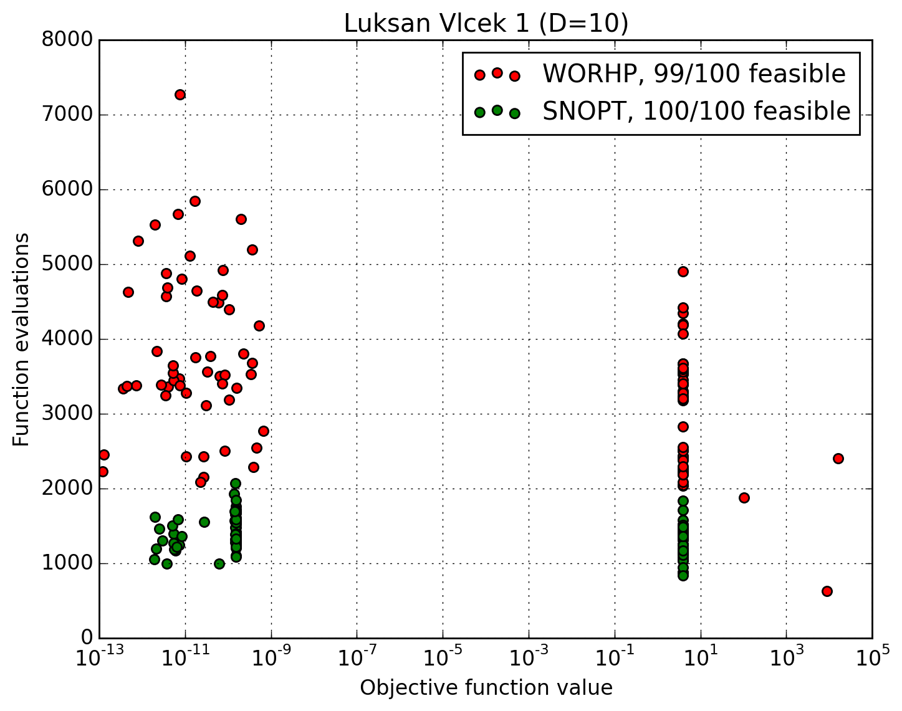
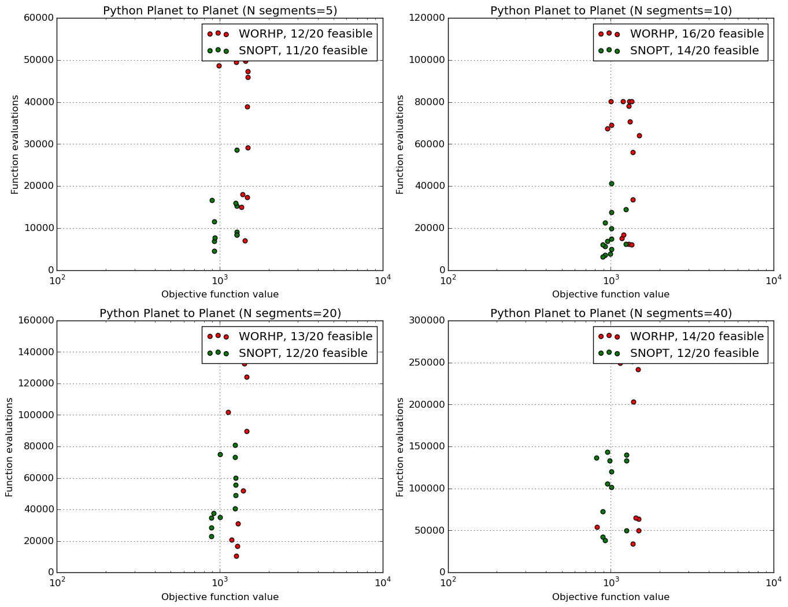

.. _local_optimization:

==========================================
Third-party Non-linear optimizers in PyGMO
==========================================

Besides a variety of available metaheuristics and global optimization algorithms, PaGMO interfaces to several popular local optimizers (full list available on page :ref:`algorithms`).
Local optimization algorithms are interfaced such that they are compatible with all of other PyGMO features, such as island model.
In this example we will present several features and use cases of nonlinear local optimizers available in PyGMO.

.. note::
 Almost all of the local optimizers (with an exception of :class:`PyGMO.algorithm.cs` available in PaGMO are interfaces to third-party dependencies.
 When using Python local optimizers (such as :class:`PyGMO.algorithm.scipy_fmin`), corresponding Python dependencies have to be installed.
 To use other high-performance optimizers (e.g.: :class:`PyGMO.algorithm.snopt`), PaGMO has to be compiled with the corresponding flag (e.g.: ``ENABLE_SNOPT``), while the library has to be installed and visible to the build system.

In the remainder of this section we will show how to use the SNOPT and WHORP nonlinear optimizers in PyGMO.

SNOPT library
=============

Installation
------------

To use SNOPT you first need to obtain either the full version of the library, or request a trial version from here:
https://ccom.ucsd.edu/~optimizers/downloads.php
Installation is to be followed according with the instructions provided on SNOPT software, according to your operating system.

Once SNOPT is installed in the system, you need to recompile PaGMO with ``ENABLE_SNOPT=ON`` flag.

Usage
-----

The following script optimizes the :class:`PyGMO.problem.luksan_vlcek_1` problem using default SNOPT configuration.

.. code-block:: python

    from PyGMO import *

    prob = problem.luksan_vlcek_1(10)
    # One 'individual', i.e. initial condition, is sufficient for local optimization
    pop = population(prob, 1)  # Population with one individual
    alg = algorithm.snopt()  # Use SNOPT library
    pop = alg.evolve(pop)
    print(pop.champion.x)
    print(pop.champion.f)

Additionally, several parameters of SNOPT are exposed to the Python interface:

.. code-block:: python

    # Set the upper limit on number of iterations, feasibility and optimality tolerances
    # and print SNOPT output the screen.
    alg = algorithm.snopt(major_iter=1000, feas_tol=1e-10, opt_tol=1e-10, screen_output=True)
    pop = population(prob, 1)
    pop = alg.evolve(pop)
    print(pop.champion.x)
    print(pop.champion.f)

WORHP library
=============

Installation
------------
.. note::
 PyGMO is supporting WORHP with version 1.8

Compiled WORHP library interface can be found at http://www.worhp.de/.
The software package contains the binaries and the header files, which have to be installed in the system (see installation guide available on the official WORHP website).

WORHP optimizer, besides requiring third party dependencies, also checks for a valid license and a configuration file.
License file ``worhp.lic`` can either reside in the current working directory or be referenced by the ``WORHP_LICENSE_FILE`` environment variable (either full or absolute path with the filename). Similarly the parameter configuration file ``param.xml`` can reside in the working directory or be referenced by ``WORHP_PARAM_FILE``. PaGMO needs to be compiled witht the flag ``ENABLE_WORHP=ON``.

Usage
-----

Use case of :class:`PyGMO.algorithm.worhp` is the same as that of the SNOPT as show previously.
Additionally to three key parameters exposed in the constructor, it is also possible to set some WORHP parameters through the setter.

.. note::
 Three parameters are already exposed in the constructor of worhp algorithm (``TolFeas``, ``TolOpti`` and ``MaxIter``).
 Each of those is also set to the default values other than the specified in the default configuration file.
 **All parameters set by a setter method, as well as the parameters in the constructor (also the defaults!) are oveloading the values from the configuration file ``param.xml``.**
 List of setter-exposed WORHP parameters is available at: https://github.com/esa/pagmo/blob/master/src/algorithm/worhp_cpp_wrapper/set_get_params.cpp

Script below shows a use case of WORHP as local optimizer in PaGMO:

.. code-block:: python

    from PyGMO import *

    prob = problem.py_pl2pl()
    pop = population(prob, 1)
    alg = algorithm.worhp(MaxIter=1000, TolFeas=1e-10)
    alg.set_param("AcceptTolOpti", 1e-4)
    pop = alg.evolve(pop)
    print(pop.champion.x)
    print(pop.champion.f)

SNOPT and WORHP comparison
==========================

In this section we will aim at providing some basic comparison between two algorithms on one standard benchmark problem and a trajectory optimization problem.

First, we will define functions used for running and experiment and plotting the results:

.. code-block:: python

    from PyGMO import population, problem, algorithm
    import PyKEP
    import sys
    import random
    import matplotlib.pyplot as plt
    import matplotlib.gridspec as gridspec

    def run(seed, alg, prob):
        pop = population(prob, 1, seed)
        pop = alg.evolve(pop)
        feas = prob.feasibility_x(pop.champion.x)
        return (pop.champion.f[0], pop.problem.fevals, feas)

    def plot(l, title, ax):
        a1, a2 = zip(*l)

        d = filter(lambda x: x[2], a1)
        if d:
            ax.scatter(zip(*d)[0], zip(*d)[1], c='r', s=30, marker='o', label='WORHP, {}/{} feasible'.format(len(d), len(a1)))
        
        d = filter(lambda x: x[2], a2)
        if d:
            ax.scatter(zip(*d)[0], zip(*d)[1], c='g', s=30, marker='o', label='SNOPT, {}/{} feasible'.format(len(d), len(a1)))
        
        ax.legend()
        ax.set_xlabel('Objective function value')
        ax.grid(True)
        ax.set_ylabel('Function evaluations')
        ax.set_title(title)

We compute 100 solutions to Luksan-Vlcek problem (dim=10) using SNOPT and WORHP, and plot the obtained objective function value against the number of function evaluations.
For each comparison we start with the same initial conditions.

.. code-block:: python

    prob = problem.luksan_vlcek_1(10)

    l = []
    N = 100  # number of restarts
    sys.stdout.write("Computing {} luksan_vlcek_1 solutions..\n".format(N))

    for i in range(1, N + 1):
        tmp = []    
        seed = random.randint(0,1000000)  # We start from the same initial conditions
        tmp.append(run(seed, algorithm.worhp(MaxIter=1000, TolFeas=1e-8, TolOpti=1e-8), prob))
        tmp.append(run(seed, algorithm.snopt(major_iter=1000, feas_tol=1e-8, opt_tol=1e-8), prob))
        l.append(tmp)
        sys.stdout.write("{}/{} ".format(i, N))
    
    ax.set_xscale('log')
    plot(l, "Luksan Vlcek 1 (D=10)", ax=plt.gca())
    plt.show()

Results of the script are as follows:

It can be concluded that SNOPT algorithm spends less function evaluations to achieve similar solution quality, while both algorithms get stuck in local optimia in roughly half of the runs.

Similarly we compute 20 solutions to Python planet to planet (Earth to Mars) problem (Requires PyKEP, while PyGMO needs to be compiled with ``ENABLE_GTOC=ON``):

.. code-block:: python

    # Warning: This is a very long test, Change N to something smaller (5) to get a quick overview
    N = 20  # number of restarts

    gs = gridspec.GridSpec(2, 2)
    ll = []
    for ax_i, n_seg in enumerate([5, 10, 20, 40]):
        l = []
        sys.stdout.write("Computing {} py_pl2pl solutions for {} segments..\n".format(N, n_seg))
        for i in range(1, N + 1):
            prob = problem.py_pl2pl(nseg=n_seg)
            tmp = []
            seed = random.randint(0, 1000000)  # We start from the same initial conditions
            tmp.append(run(seed, algorithm.worhp(MaxIter=1000, TolFeas=1e-8, TolOpti=1e-8), prob))
            tmp.append(run(seed, algorithm.snopt(major_iter=1000, feas_tol=1e-8, opt_tol=1e-8), prob))
            l.append(tmp)
            sys.stdout.write("{}/{} ".format(i, N))
        ll.append(l)
        sys.stdout.write("\n")
        ax = plt.subplot(gs[ax_i / 2, ax_i % 2])
        plot(l, "Python Planet to Planet (N segments={})".format(n_seg), ax=ax)
    plt.show()

