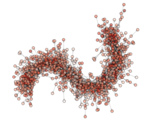

Welcome to PyGMO
================

.. toctree::
   :maxdepth: 2
   :hidden:

   install
   quickstart
   tutorials/index
   examples/index
   documentation/index
   PaGMO API <http://esa.github.io/pagmo/>

PyGMO (the Python Parallel Global Multiobjective Optimizer) is a scientific library providing a large number
of optimisation problems and algorithms under the same powerful parallelization
abstraction built around the *generalized island-model* paradigm. What this means to the user is that the available algorithms
are all **automatically parallelized** (asynchronously, coarse-grained approach) thus making efficient use of the underlying multicore
architecture. The user can also program his own solvers ... they also will be parallelized by PyGMO!! PyGMO's
implementation of the *generalized migration operator* allows the user to easily define "migration paths" (topologies) between a large number of "islands" (CPU cores).

Efficient implementantions of state-of-the-art bio-inspired algorithms are sided to state-of the art
optimization algorithms (Simplex Methods, SQP methods ....) and can be easily mixed 
(also with your newly invented algorithms) to build a super-algorithm exploiting cooperation via
the asynchronous, generalized island model.

Many complex-networks topologies (Hypercube, Ring, Barabasi-Albert, Watts-Strogatz, Erdos-Renyi, etc.)
are built-in and may be used to define the migration pathways of good solutions among islands.
Custom topologies are also possible.

**PyGMO can be used to solve constrained, unconstrained, single objective, multiple objective, 
continuous, mixed int optimization problem, or to perform research on novel algorithms
and paradigms and easily compare them to state of the art implementations of established ones.**

PyGMO is interfaced with SciPy optimization algorithms, NLOPT algorithms, GSL algorithms, SNOPT, IPOPT and, hopefully .... more to come. Packages such as networkx and vpython enhance functionalities allowing advanced visualization options.

Please send your comments via the `pagmo/PyGMO mailing list <http://sourceforge.net/mail/?group_id=238743>`_ and submit any
bugs via our `pagmo/PyGMO bug-tracker <http://sourceforge.net/tracker/?group_id=238743&atid=1133009>`_

ON THE ANIMATION ABOVE: One animation is worth a lot of words!!! So here are the 'words' explaining what you see in the animation.
This is a visualization of an optimization (*evolution*) in a PyGMO archipelago containing 490 islands. Particle Swarm optimization is used in all islands each containing
20 individuals. The interpanetary trajectory problem Cassini is being solved. This is a problem from the `GTOP database <http://www.esa.int/gsp/ACT/inf/op/globopt.htm>`_ (all of which included in PyGMO). Red dots are islands
containing the worst solution so far, white dots are islands containing the best solution so far. All other islands colors are scaled from white to red according to their champion's fitness. The islands are connected using a Barabasi-Albert ageing clustered topology. The code below reproduces the optimization and shows how to create  figures. The animation can then be made by putting together all figures produced.

.. code-block:: python

	# We need networkx installed and PyGMO compiled with the keplerian_toolbox option activated
	# Also start this in ipython with the --pylab option
	from PyGMO import *
	from matplotlib.pyplot import savefig, close

	#We instantiate the GTOP problem called cassini_1
	prob = problem.cassini_1()

	#We instantiate the algorithm Differential Evolution fixing 10 generations for each call
	algo = algorithm.de(gen=10)

	#Here we instantiate the archipelago with 490 islands an 20 individuals per island .....
	archi = archipelago(algo,prob,490,20,topology = topology.ageing_clustered_ba(a=25))

	#We can draw an archipelago like this
	pos  = archi.draw(n_size=10, scale_by_degree=True, e_alpha=0.03)
	savefig('archi000')
	close()
	
	#And we start the evolution loops (each evolve will advance each island 10 generation)
	for i in range(200):
		#this opens 490 threads ..... each one evolving its population using algo!!!
		archi.evolve(1)
		archi.join()
		print "Drawing " + str(i) + "-th evolution .."
		pos = archi.draw(layout = pos, scale_by_degree=True, n_size=10, e_alpha=0.03)
		savefig('archi%03d' % i, dpi = 72);
		close()
