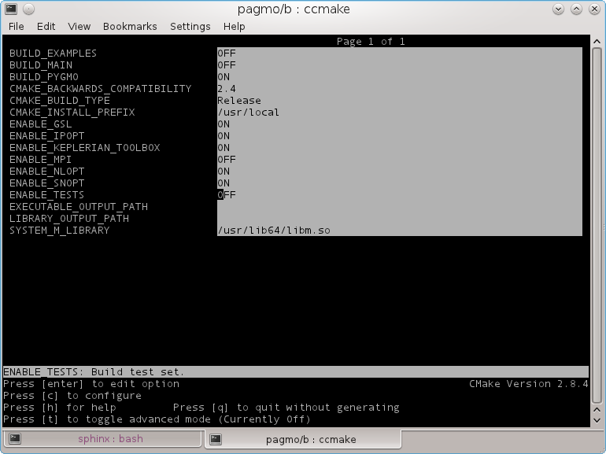
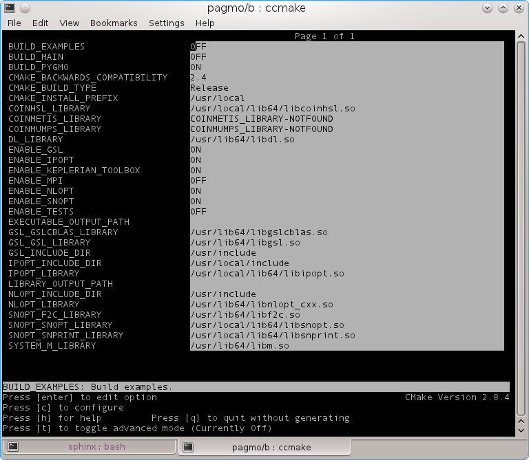
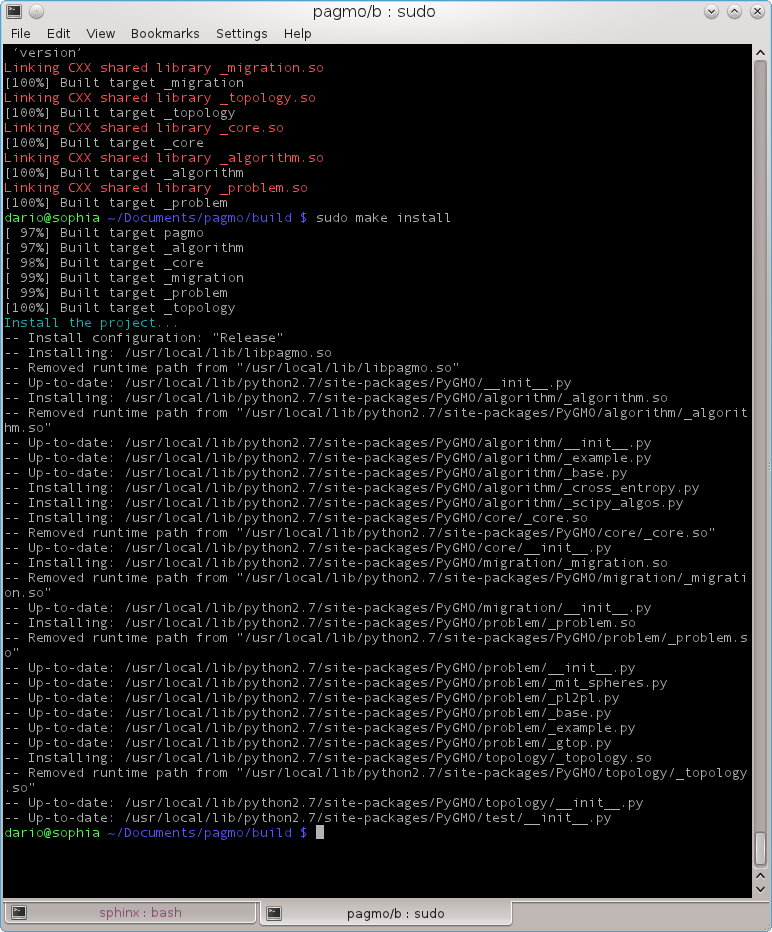

.. _howtoinstall:

Install PyGMO
=============

Preparing your system to compile PyGMO
--------------------------------------

We assume you have root access to your unix machine (or you are administering your Windows machine)
and a working python installation. As PyGMO has some dependencies, you will need to install
a few packages before being able to install PyGMO on your machine. All are supported by most package managers,
so that a simple apt-get or emerge should suffice to prepare your system.

* Install `git <http://git-scm.com>`_
* Install `CMake <http://www.cmake.org>`_ with its ccmake utility
* Install `boost libraries <http://www.boost.org>`_ both headers and compiled libraries

Other packages are actually optional and they will enhance PyGMO functionalities if present:

* SNOPT (proprietary)
* `IPOPT <https://projects.coin-or.org/Ipopt>`_
* `SciPy <http://www.scipy.org/>`_
* `NLOPT <http://ab-initio.mit.edu/wiki/index.php/NLopt>`_ (compiled with the c++ flag activated)
* `GSL <http://www.gnu.org/s/gsl/>`_ (version 1.15 required)
* `PyKEP <http://keptoolbox.sourceforge.net/>`_ (version 1.15 required)

These packages need to be compiled in such a way as to allow PyGMO 1) to find them 2) tho use them.
See the dedicated pages on how to make sure this happens.

Download PyGMO code
-------------------

PyGMO source code is part of the `pagmo GitHub  project <https://github.com/esa/pagmo/>`_.
The `git`_ versioning system is needed to access the code. 

Open a terminal (where git is available) and type::

  git clone https://github.com/esa/pagmo.git 

Compiling and Installing under Unix
-----------------------------------

Assuming you have just downloaded the source code you will have created a directory pagmo in your current directory, move there::

  cd pagmo

You will now need to create a build directory where to build the source code, so::

  mkdir build

You can now move there::

  cd build

and have ccmake help you select the options that are most suitable for you::

  ccmake ../

After pressing c once, a typical ccmake screen will look like 

note that the PyGMO option is selcted as well as other options requiring external libraries ....

At this point (after pressing c again) in case all required system libraries are found
you should be seeing something like this on the screen:

You can now press 'g' to generate a make file and exit ccmake utility. You are back to the prompt where you can now type::

  make

and::

  sudo make install

Watch carefully the message in the terminal where the installation path is given to check 
that the correct python dist-packages or site-packages directory has been located

Here is a typical example of the output obtained (gentoo system):

Compiling and Installing under Windows
--------------------------------------

We here outline the procedure we followed when providing the Windows Binaries. In our system, we had
CMake 2.8.6, Python 2.7, Boost 1.47.0 and MinGW with Msys 1.0.11 (all installed in C:)

* We compiled the boost libraries with the command ".\b2 toolset=gcc link=shared" 
* NOTE: The whole boost directory must be placed where the CMake script can find it (e.g. in C:/boost). 
  This required renaming the folder from "boost_x_xx_xx" to "boost") Alternatively, one can directly tell CMake where the boost_x_xx_xx folder is, in which case make sure to fill in both
  the header and the library fields (toggling advanced view)
* Check, when running CMake, that all libraries are found correctly
* When running a make install, Windows will probably put your PyGMO directory under Program Files/PyGMO,
  move it to the correct place (e.g. C:/Python27/Lib/site-packages/)
* Remember to place the necessary libraries in Windows/System32. In particular you will need
  a) the pagmo library (libpagmo.dll)
  b) the boost date-time library
  c) the boost serialization library
  d) the boost python library
  e) the boost thread library

* You need to place the minGW ibraries libgfortran-3.dll, libquadmath-0.dll and pthreadGC2 in the core directory.

* If the option GSL is activated you need to provide the GSL libraries, in particular 
	a) libgslcblas.a b) libgsl.a c) the include dir of gsl. We have compiled gsl-1.15 using msys 1.0.11 configure make install
	(it first required to define "#define HAVE_DECL_ISNAN 1" and " #define HAVE_DECL_FINITE 1" in config.h of the gsl downloaded distribution). The static libs
	are then created in cblas/.lib and /lib. We have pointed CMake to those files and to msys local/include for the include files.
	One could also link to the dynamic .dll files that are created in the local/lib directry of msys after make install. In
	this case remember to put those libraries (libgsl-0.dll and libgslcblas-0.dll) in the folder System32 too.
	
* If the option Ipopt is activated you need to tell CMake explicitly where to find Ipopt, in particular 
  a) libcoinblas.a b) libcoinlapack.a c) libcoinmumps.a d) libipopt.a e) The include dir of ipopt.
  We have compiled Ipopt 3.10.1 using msys 1.0.11 and the usual config make install procedure ..... 
  (MUMPS is used as linear solver) and later linked to the static libraries created in lib/.
  
* If the option NLOPT is activated you need to tell CMake explicitly where to find NLOPT and in particular
  a) nlopt-0.dll b) nlopt.h and nlopt.hhp. We downloaded the already available Windows binaries for NLOPT 2.2.3
  
  
