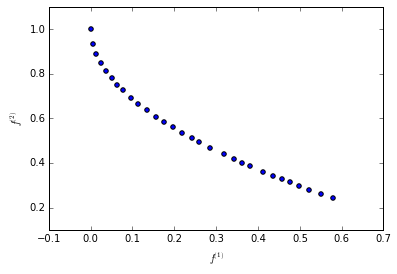

Adding a new optimization problem
=================================

In this Tutorial we will learn how to code simple optimization problems
(continuous, single objective, unconstrained), so that PyGMO can then
apply all of its algorithmic power to solve it. In a nutshell, we will
write a class deriving from **PyGMO.problem.base** and reimplement some
of its ‘virtual’ methods.

Simple single objective problem
-------------------------------

Let us start with defining one of the classic textbook examples of an
optimization problem.

.. code:: python

    from PyGMO.problem import base
    
    class my_problem(base):
        """
        De Jong (sphere) function implemented purely in Python.
        
        USAGE: my_problem(dim=10)
        
        * dim problem dimension
        """
        
        def __init__(self, dim=10):
            # First we call the constructor of the base class telling PyGMO
            # what kind of problem to expect ('dim' dimensions, 1 objective, 0 contraints etc.)
            super(my_problem,self).__init__(dim)
        
            # We set the problem bounds (in this case equal for all components)
            self.set_bounds(-5.12, 5.12)
        
        # Reimplement the virtual method that defines the objective function.
        def _objfun_impl(self, x):
            
            # Compute the sphere function
            f = sum([x[i] ** 2 for i in range(self.dimension)])
            
            # Note that we return a tuple with one element only. In PyGMO the objective functions
            # return tuples so that multi-objective optimization is also possible.
            return (f, )
        
        # Finally we also reimplement a virtual method that adds some output to the __repr__ method
        def human_readable_extra(self):
            return "\n\t Problem dimension: " + str(self.__dim)
Note that by default PyGMO will assume one wants to minimize the
objective function. In the second part of this tutorial we will also see
how it is possible to change this default behaviour.

To solve our problem we will use Artificial Bee Colony algorithm with 20
individuals.

.. code:: python

    from PyGMO import algorithm, island
    
    prob = my_problem(dim=10)  # Create a 10-dimensional problem
    algo = algorithm.bee_colony(gen=500)  # 500 generations of bee_colony algorithm
    isl = island(algo, prob, 20)  # Instantiate population with 20 individuals
    isl.evolve(1)  # Evolve the island once
    isl.join()
    print(isl.population.champion.f)

.. parsed-literal::

    (5.800103096468531e-25,)

And we are done! Objective value in the order of :math:`10^{-25}`, no
big deal for a sphere problem.

Maximization problem
--------------------

Let’s consider now a maximization problem. To solve such a problem, two
possibilities are available to the PaGMO/PyGMO user. The first one is to
code the original problem as a minimization problem by premultiplying
the objective function by :math:`-1` (a technique wich is often used and
requires no particular effort). If such a method is used, the final
fitness value obtained with PyGMO has to be multiplied by :math:`-1` to
get back to the correct value.

A second method, more elegant and most of all serving the purpose to
show the use of another virtual method which can be reimplemented in
python objects deriving from base, is to override the function that
compares two fitness vectors. This function is used by all pagmo
algorithms to compare performances of individuals. By default, this
function compares the fitness :math:`f_1` to a fitness :math:`f_2` and
returns true if :math:`f_1` dominates :math:`f_2` (which is single
objective optimization correspond to minimization). Let us see how...

.. code:: python

    class my_problem_max(base):
        """
        Analytical function to maximize.
    
        USAGE: my_problem_max()
        """
        
        def __init__(self):
            super(my_problem_max,self).__init__(2)
            self.set_bounds(-10, 10)
            
            # We provide a list of the best known solutions to the problem
            self.best_x = [[1.0, -1.0], ]
    
        # Reimplement the virtual method that defines the objective function
        def _objfun_impl(self, x):
            f = -(1.0 - x[0]) ** 2 - 100 * (-x[0] ** 2 - x[1]) ** 2 - 1.0
            return (f, )
    
        # Reimplement the virtual method that compares fitnesses
        def _compare_fitness_impl(self, f1, f2):
            return f1[0] > f2[0]
    
        # Add some output to __repr__
        def human_readable_extra(self):
            return "\n\tMaximization problem"
Additionally in the constructor we provide a list of all known global
minima (we will use those later for testing). The list of corresponding
objective function values will be then computed and accessible through
**best\_f** of the problem's instance.

As before, we use our favorite optimization algorithm:

.. code:: python

    from math import sqrt
    
    prob = my_problem_max()
    algo = algorithm.de(gen=20)
    isl = island(algo, prob, 20)
    isl.evolve(10)
    isl.join()
    
    print("Best individual:")
    print(isl.population.champion)
    
    print("Comparison of the best found fitness with the best known fitness:")
    for best_fitness in prob.best_f:
        print(best_fitness[0] - isl.population.champion.f[0])
    
    print("L2 distance to the best decision vector:")
    for best_decision in prob.best_x:
        l2_norm = 0
        for n in range(0, len(best_decision)):
            l2_norm +=  (best_decision[n] - isl.population.champion.x[n]) ** 2
        l2_norm = sqrt(l2_norm)
        print(l2_norm)

.. parsed-literal::

    Best individual:
    	Decision vector:	[1.0000035381312899, -1.000007979785372]
    	Constraints vector:	[]
    	Fitness vector:		[-1.0000000000941514]
    
    Comparison of the best found fitness with the best known fitness:
    9.41513533803e-11
    L2 distance to the best decision vector:
    8.72899465051e-06

Note here that we used the **best\_f** and **best\_x** methods which
return the best known fitness and decision vectors. The **best\_f**
vector is automatically available as we defined **best\_x** in the
problem. With these vectors, we can have an idea of the optimizer
performances. The result of this optimization should be in order of
:math:`10^{-11}` for the comparison with the best fitness and
:math:`10^{-6}` for the distance to the best decision vector.

Multi-objective problem
-----------------------

As hinted before, users can also define their own multi-objective
problem. In that case we need to overload the the base constructor with
third argument stating the desired objective function dimension and
return a tuple or a list with more than one element in the objective
function implementation (both dimensions must agree).

.. code:: python

    class my_mo_problem(base):
        """
        A multi-objective problem.
        (This is actually a Python implementation of 2-dimensional ZDT-1 problem)
    
        USAGE: my_mo_problem()
        """
        
        def __init__(self, dim=2):
            # We call the base constructor as 'dim' dimensional problem, with 0 integer parts and 2 objectives.
            super(my_mo_problem,self).__init__(dim, 0, 2)
            self.set_bounds(0.0, 1.0)
    
        # Reimplement the virtual method that defines the objective function
        def _objfun_impl(self, x):
            f0 = x[0]
            g = 1.0 + 4.5 * x[1]
            f1 = g * (1.0 - sqrt(f0 / g))
            return (f0, f1, )
    
        # Add some output to __repr__
        def human_readable_extra(self):
            return "\n\tMulti-Objective problem"
We instantiate our problem as before, but this time we use one of the
multi-objective algorithms available in PaGMO:

.. code:: python

    from PyGMO import population
    
    prob = my_mo_problem()
    algo = algorithm.sms_emoa(gen=2000)  # 2000 generations of SMS-EMOA should solve it
    pop = population(prob, 30)
    pop = algo.evolve(pop)
Since in the Multi-Objective world the idea of a single 'champion'
solution is not very well defined, we plot the Pareto front of the whole
population, i.e., the two objectives :math:`f_i^{(1)}` and
:math:`f_i^{(2)}` of each individual :math:`i \in 1,\ldots,30`.

.. code:: python

    %matplotlib inline
    import matplotlib.pyplot as plt
    import numpy as np
    
    # Fold each objectives into vectors and print the Pareto front
    F = np.array([ind.cur_f for ind in pop]).T
    plt.scatter(F[0], F[1])
    plt.xlabel("$f^{(1)}$")
    plt.ylabel("$f^{(2)}$")
    plt.show()

NOTE1: This problems of tutorial are implemented in PyGMO under the name
**PyGMO.problem.py\_example** and **PyGMO.problem.py\_example\_max**

NOTE2: When evolve is called from an island, the process is forked and
transferred to another python or ipython instance. As a consequence,
when writing your ***obj*\ fun\_impl** you cannot use stuff like
matplotlib to make interactive plots and alike. If you need, during
development, to have this kind of support, use the algorithm evolve
method (see the optimization of the Multi-Objective problemabove)

NOTE3: If performance is your goal, you should implement your problem in
C++, and then expose it into Python.
