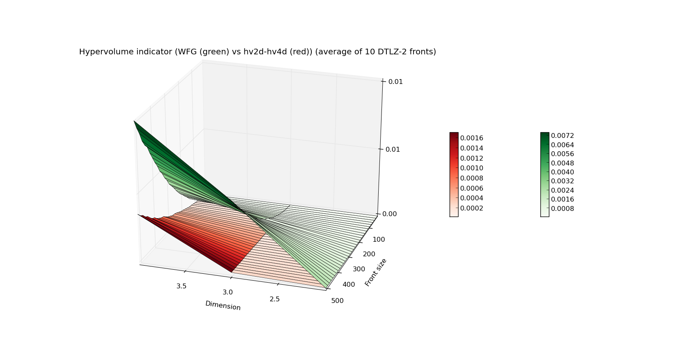
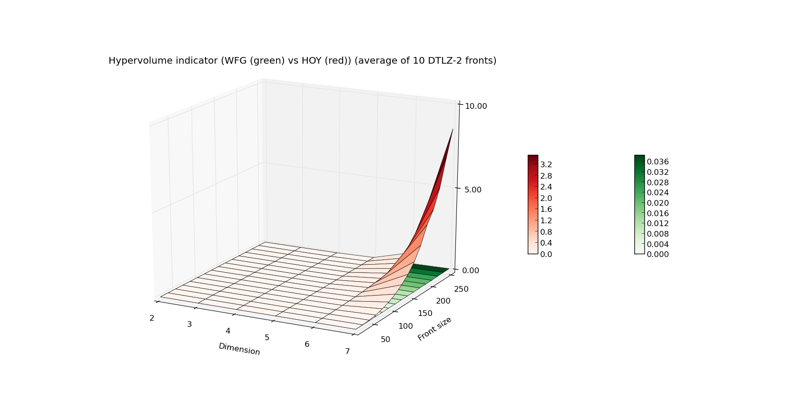

.. _advanced_hypervolume_computation_and_analysis:

=============================================
Advanced hypervolume computation and analysis
=============================================

In this tutorial we will cover some more advanced topics of hypervolume computation.
We will present some more use cases for the computation and give out details on the expected performance of the engine.

Computing hypervolume using specific algorithm
==============================================

By default, present hypervolume module in pagmo is capable of choosing the best performing algorithm for given case.
It is possible however to bypass that feature, and enforce pygmo to compute given problem using a specific algorithm.
Be wary that some algorithms may assume certain conditions to be true (e.g. some may work only for specific dimension).
In case of an incompatible algorithm to the hypervolume problem, an exception will be raised.

An example of a hypervolume problem using a specific algorithm:

.. code-block:: python

  from PyGMO.util import hypervolume
  hv = hypervolume([[1,0,1],[1,1,0],[-1,2,2]])
  hv.compute(r=(5,)*3, algorithm=hv_algorithm.wfg())
  

Code above will compute the 3-dimensional problem, using the WFG algorithm.
Notice that two names visible in the global scope that rely to hypervolume computation are *hypervolume*, which is a class containing the easy user interface for computation, and the *hv_algorithm*, which contains specific implementations of various algorithms.
The list of available algorithms can be easily obtained by executing the following in the *IPython* session:

.. code-block:: python

  In [1]: from PyGMO import *
  In [2]: hv_algorithm?  # Will reveal the extended doc string of this method
  

As of yet, the list contains the following implementations:

#. hv2d
#. hv3d
#. hv4d
#. wfg
#. bf_approx
#. bf_fpras
#. hoy

You can get more information on the implementation of specific algorithm, its reference, limitations and assumptions using the same "?" feature of *IPython*:

.. code-block:: python

  In [1]: from PyGMO import *
  In [2]: hv_algorithm.wfg?  # Will reveal extended doc string of this method
  

**Note:**
Some algorithms may not provide certain functionalities, e.g.: *hv4d* algorithm which is destined for efficient computation of 4-dimensional hypervolumes, supports only the "compute" method.
When the `PyGMO.hypervolume` object is initiated with 4-dimensional list of points, and the computation of any of the exclusive contribution features is requested, it is actually the `PyGMO.hv_algorithm.wfg` algorithm handles it.

Runtime analysis of the hypervolume computation
===============================================

Over the course of development we have gathered a wide range of algorithms to choose from when facing given problem.
We utilize this fact to provide users with an efficient computation engine.
During the course of the experiment, we have measured the practical capabilities of our engine for fronts with varying variables **N** (number of points) and **f_dim** (dimension).
The results are shown below:

.. image:: ../images/tutorials/hv_compute_runtime_plot.png
  :width: 850px

.. image:: ../images/tutorials/hv_MAX_compute_runtime_plot.png
  :width: 850px

The first plot above shows the running time (average of 10 fronts per given combination of **N** and **f_dim**) of computing the front of a DTLZ-2 problem.
Plot below, the worst case scenario (maximal time of 10 runs for given **N** and **f_dim**).
The Z axis as well as the color indicate the execution time in seconds.
As you can see, computation of the hypervolume of 100 points and below is pretty fast, even when facing a 10-dimensional problem.
When you're designing your own experiment, be wary that the worst case complexity of hypervolume algorithms is exponential.

Although the hypervolume indicator is the most common metric, as it measures the quality of given pareto front.
Many multiple-objective optimizers require slightly different measure, that evaluates the quality of given individual within population.
This is resolved by computing the exclusive contribution of given individual to the population, and in most cases boils down to eliminating the individual that contributes the least.
For that reason, we would also want to make sure that **least_contributor** method is usable in practice, which resulted in the following experiment:

.. image:: ../images/tutorials/hv_lc_runtime_plot.png
  :width: 850px

.. image:: ../images/tutorials/hv_MAX_lc_runtime_plot.png
  :width: 850px
  
The increase in the execution time is progressing in a strikingly similar fashion, yet the Z axis is now scaled by a factor of 10.
This data is especially crucial if you want to use the SMS-EMOA algorithm, which is based on the least contributor feature.

Algorithm comparison
====================

In this section we will present a quick comparison of the available algorithms, which will support our our choice for the default set of algorithms.
Since in many cases, multiple objective problems are either 2 or 3-dimensional, it was important to have a dedicated algorithm for each of the scenarios.
At the moment, there are three algorithms that are specific to given dimension:

#. `PyGMO.hv_algorithm.hv2d`
#. `PyGMO.hv_algorithm.hv3d`
#. `PyGMO.hv_algorithm.hv4d`

Besides that, there are two exact algorithms which do not restrict the dimension size:

#. `PyGMO.hv_algorithm.wfg`
#. `PyGMO.hv_algorithm.hoy`

In the following sections we will compare their effectiveness to give you a hint on how they compare in practice.

Algorithms for 2, 3 and 4 dimensions
------------------------------------

In this section we will show that dedicated algorithms for 2, 3 and 4 dimensions do in fact perform better than the general purpose ones in terms of running time.

General purpose algorithm
-------------------------

During the course of the development we have decided to make WFG a general purpose algorithm for the computation.
We had a chance to select HOY as a good candidate, but after measuring their execution time, it was clear that the former was more efficient.

Plot below describes the comparison of runtime of WFG and HOY. We have limited the dimension size to 7 this time, as it took far too long for HOY to compute.

Two algorithms behave similarly up to fifth dimension. Then, a distinction in runtime is visible: HOY (palette of reds) skyrockets in the computation time for **f_dim** = 6 and above, while WFG (palette of greens) remains below it, suggesting that WFG is a better candidate.
When designing your own experiment or algorithm, be wary of the limitations of HOY in higher dimensions.

