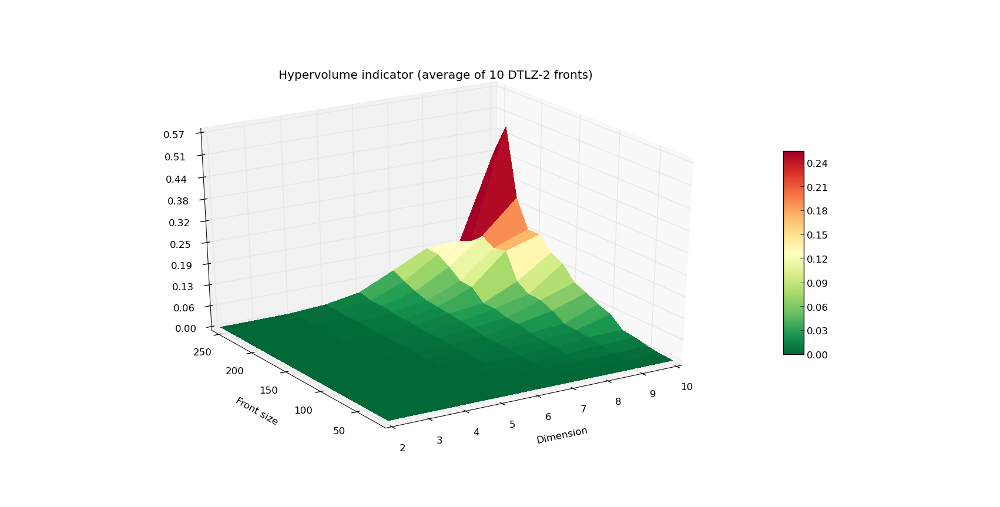
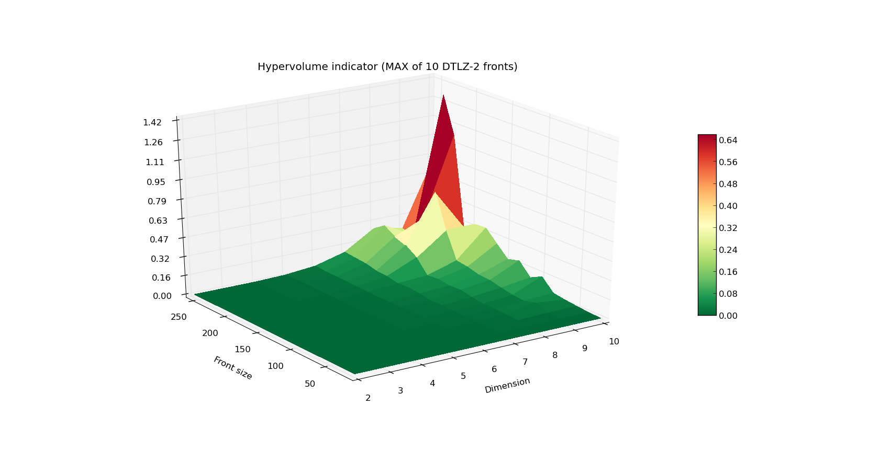
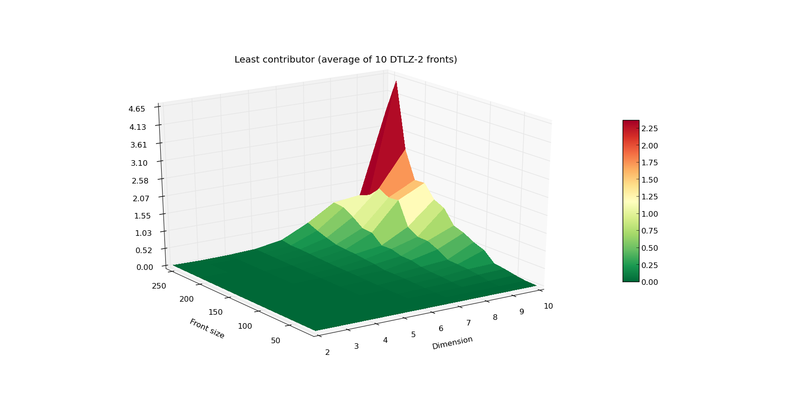
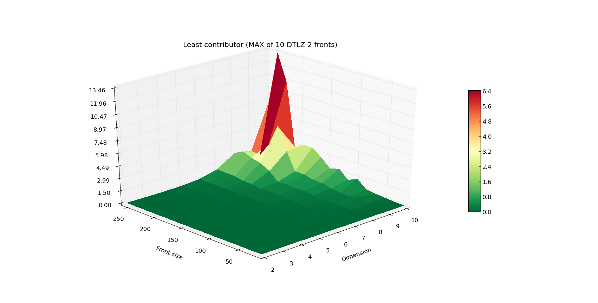

.. _advanced_hypervolume_computation_and_analysis:

=============================================
Advanced hypervolume computation and analysis
=============================================

In this tutorial we will cover some more advanced topics regarding hypervolume computation and explain details on the expected performance of the engine.

Computing hypervolume using a specific algorithm
================================================

PyGMO uses different algorithms for computing the hypervolume indicator and the hypervolume contributions. By default 
it picks the algorithm which is *expected* to yield the fastest computation with respect to the dimensionality of the given point-set. This selection can be bypassed by using an explicit hv_algorithm object as a parameter of the corresponding method:

.. code-block:: python

  from PyGMO.util import hypervolume, hv_algorithm
  hv = hypervolume([[1,0,1],[1,1,0],[-1,2,2]])
  hv.compute(r=(5,)*3, algorithm=hv_algorithm.wfg())
  
The code above will compute the hypervolume indicator using the WFG algorithm, whereas

.. code-block:: python

  hv.compute(r=(5,)*3)

would use (by default) the hv3d algorithm, since it is expected to be faster for three dimensions.

Notice that the two names visible in the global scope that relate to hypervolume computations are *hypervolume*, which is a class containing the easy user interface for computation, and the *hv_algorithm*, which contains specific implementations of various algorithms.
The list of available algorithms can be easily obtained by executing the following in the *IPython* session:

.. code-block:: python

  In [1]: from PyGMO.util import *
  In [2]: hv_algorithm?  # Will reveal the extended doc string of this method
  
As of yet, the list contains the following implementations:

#. hv2d
#. hv3d
#. hv4d
#. wfg
#. hoy
#. bf_approx
#. bf_fpras

You can get more information on the implementation of specific algorithm, its reference, limitations and assumptions using the same "?" feature of *IPython*, or in the :ref:`hypervolume` section of the documentation.

.. code-block:: python

  In [1]: from PyGMO.util import *
  In [2]: hv_algorithm.wfg?  # Will reveal extended doc string of this method
  
.. note::
 Some algorithms may not provide certain functionalities, e.g.: *hv4d* algorithm which is designed for efficient computation of 4-dimensional hypervolumes, supports only the "compute" method.
 When the `PyGMO.util.hypervolume` object is initiated with 4-dimensional list of points, and the computation of any of the exclusive contribution features is requested, it is actually the `PyGMO.util.hv_algorithm.wfg` algorithm handles it. Under no circumstances `PyGMO.util.hypervolume` object will use any of the approximated algorithms, so the only way to use them is by the explicit request.

We will discuss the details on the approximated hypervolume in the tutorial :ref:`approximating_the_hypervolume`. This tutorial will focus only on the exact methods.

Runtime analysis of the hypervolume computation
===============================================

We have gathered a wide range of algorithms to choose from when in need to compute hypervolumes.
We utilize this fact to provide users with an efficient computation engine that will most likely pick the fastest algorithm on default. During the course of the experiment, we have measured the practical capabilities of our engine for fronts with varying ``Front size`` (number of points) and ``Dimension``.

.. note::
 The obtained results are specific to the hardware and the architecture of the computer on which these experiments were executed. Main idea of the plots in this and the following tutorials is to present the relative scaling of the execution time for various settings of ``Front size`` and ``Dimension``.

The results are shown below:

The first plot above shows the running time (average of 10 fronts per given combination of ``Front size`` and ``Dimension``) of computing the front of a DTLZ-2 problem.
Plot below, the worst case scenario (maximal time of 10 runs for given ``Front size`` and ``Dimension``).
The Z axis as well as the color indicate the execution time in seconds.
As you can see, computation of the hypervolume of 100 points and below is pretty fast, even when facing a 10-dimensional problem.
When you're designing your own experiment, be wary that the worst case complexity of hypervolume algorithms is exponential.

Although the hypervolume indicator is a very common quality indicator for pareto fronts, many multiple-objective optimizers require a slightly different figure that evaluates the quality of a given individual within the population.
This is resolved by computing the exclusive contribution of a given individual to the population, and in most cases boils down to eliminating the individual that contributes the least.
For that reason, we would also want to make sure that the ``least_contributor`` method is efficient, which resulted in the following experiment:

  
The increase in the execution time is progressing in a strikingly similar fashion, yet the Z axis is now scaled by a factor of 10.
This data is especially crucial if you want to use the SMS-EMOA algorithm, which is based on iterative computations of the current least contributor.

Algorithm comparison
====================

In this section we will present a quick comparison of the available algorithms, which will support our choice for the default set of algorithms.
Since in many cases, multiple objective problems are either 2 or 3-dimensional, it was important to have a dedicated algorithm for each of these scenarios.
At the moment, there are five exact algorithms in PyGMO, three of which are dedicated for certain dimensions:

#. `PyGMO.util.hv_algorithm.hv2d`
#. `PyGMO.util.hv_algorithm.hv3d`
#. `PyGMO.util.hv_algorithm.hv4d`
#. `PyGMO.util.hv_algorithm.wfg`
#. `PyGMO.util.hv_algorithm.hoy`

As of yet, PyGMO contains two general purpose algorithms - WFG (by the Walking Fish Group) and HOY (Hypervolume by Overmars and Yap).
We have measured the empirical effectiveness of both algorithms on multiple fronts, and we have noted a significant difference in the running time in favor of the WFG.
For that reason, WFG is the default general purpose algorithm in PyGMO. Since HOY is a fairly known and tested algorithm, it was useful to keep it as a reference, but it is currently never used by default. Be aware that its performance, especially for 7 and more dimensions, is most likely far worse than that of WFG.

Even though WFG is regarded one of the state of the art algorithms for hypervolume computation, several algorithms specific to lower dimensions have been derived as well.
We will show that dedicated algorithms for 2, 3 and 4 dimensions do in fact perform better than the general purpose ones in terms of running time.
Since current version of WFG progresses through dimension slicing, it stops once it obtains a 2-dimensional subproblem.
In this case, WFG delegates the computation to the `PyGMO.util.hv_algorithm.hv2d` algorithm.
For that reason it is pointless to measure its efficiency against direct execution of `PyGMO.util.hv_algorithm.hv2d`.
As for the latter, certain measurements were done to obtain the following comparisons of WFG (also for the variant in which we slice back to 3-dimensional front) and the dedicated algorithms:

.. image:: ../images/tutorials/hv_wfg_hv3d.png
  :width: 650px

.. image:: ../images/tutorials/hv_wfg_hv4d.png
  :width: 650px

It is clear that the dedicated algorithms for 3 and 4 dimensions perform better than WFG.

Short summary of algorithms
---------------------------

We have used the kind of experiments above to derive the default interface of the hypervolume engine.
For more information on which method is called by default, refer to the table below:

======================= ==== ==== ==== =========
hypervolume method      2D   3D   4D   5D and up
======================= ==== ==== ==== =========
``compute``             hv2d hv3d hv4d wfg
``contribution-based*`` hv2d hv3d wfg  wfg
======================= ==== ==== ==== =========

*contribution-based** - The following methods are considered contribution-based: ``exclusive``, ``least_contributor``, ``greatest_contributor``, ``contributions``

For the information on what method is supported by given hypervolume algorithm, refer to the table below:

============= ======= ========= ================= ==================== =============
hv_algorithm  compute exclusive least_contributor greatest_contributor contributions
============= ======= ========= ================= ==================== =============
``hv2d``      Yes     Yes       Yes               Yes                  Yes
``hv3d``      Yes     Yes       Yes               Yes                  Yes
``hv4d``      Yes     No        No                No                   No
``wfg``       Yes     Yes       Yes               Yes                  Yes
``hoy``       Yes     Yes       Yes               Yes                  Yes
``bf_approx`` No      No        Yes               Yes                  No
``bf_fpras``  Yes     No        No                No                   No
============= ======= ========= ================= ==================== =============

Pushing efficiency further
===============================

Since the computation of the hypervolume is a computationally expensive operation, we pay special attention
to resolve this task as efficient as possible.
By default, `PyGMO.util.hypervolume` object will verify the input data to make sure they meet the criteria pointed out at the beginning of this tutorial. Also, in order to preserve the internal representation of the points intact, before doing any computation a copy of the original set of points is made.
These precautions are not always necessary.

In order to turn off the verification of the input data, you can instantiate the hypervolume object in the following way:

.. code-block:: python

  # Assuming that 'pop' is an instance of the PyGMO.population
  # Points created from the individuals will not be verified
  # also, any further computation will bypass the verification of input (reference point)
  hv = hypervolume(pop, verify=False)

Additionally, a getter/setter is available as well:

.. code-block:: python

  # Assuming that 'hv' is an instance of the PyGMO.util.hypervolume
  hv.set_verify(False)
  print hv.get_verify()
  ref_point = hv.get_nadir_point(1.0)
  print hv.compute(r=ref_point)  # Warning: Will not verify the ref_point!

.. note::
 The only way to bypass the verification of the set of points is through the flag in the constructor.

Another feature that can be disabled to improve runtime is the copying of points. This is possible via the following set-method:

.. code-block:: python

  # Assuming that 'hv' is an instance of the PyGMO.util.hypervolume
  hv.set_copy_points(False)
  print hv.get_copy_points()

  ref_point = hv.get_nadir_point(1.0)
  hv.compute(r=ref_point)
  hv.compute(r=ref_point)  # Warning: Unexpected behavior, internal representation of points might have been altered!

.. warning::
  Bypassing the copying of points will most likely lead to the alteration of the internal representation of points.
  This has its benefits only when the hypervolume object is to be treated as a single use instance. We strongly discourage using the hypervolume object more than once when copying was disabled.

Bonus
------
An additional small trick you can employ for your own experiments is pulling only the first front from the population object, which will speed up the computation of the hypervolume indicator as long as there are dominated points in your input:

.. code-block:: python

  from PyGMO import *
  from PyGMO.util import *
  prob = problem.dtlz(prob_id=7, fdim=6)
  pop = population(prob, 100)

  hv = hypervolume(pop)
  ref_point = hv.get_nadir_point(1.0)
  print hv.compute(r=ref_point)

  # Code below may yield the same result faster
  hv2 = hypervolume([pop[i].cur_f for i in pop.compute_pareto_fronts()[0]])
  print hv2.compute(r=ref_point)

.. warning::
 Be cautious about employing this trick when computing any hypervolume contribution!
 In most cases, the dominated points are relevant to the exclusive contributions of the points from the first front. Also, the indexing of the points will not reflect the indices of the individuals anymore (unless you store them first).
