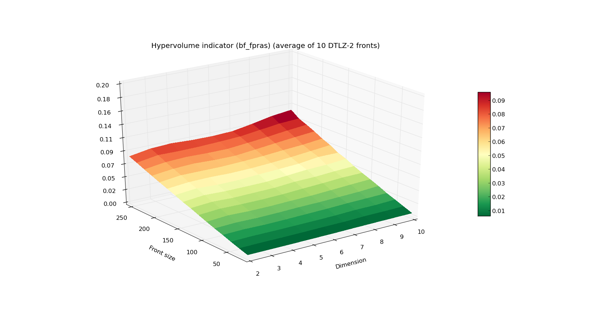
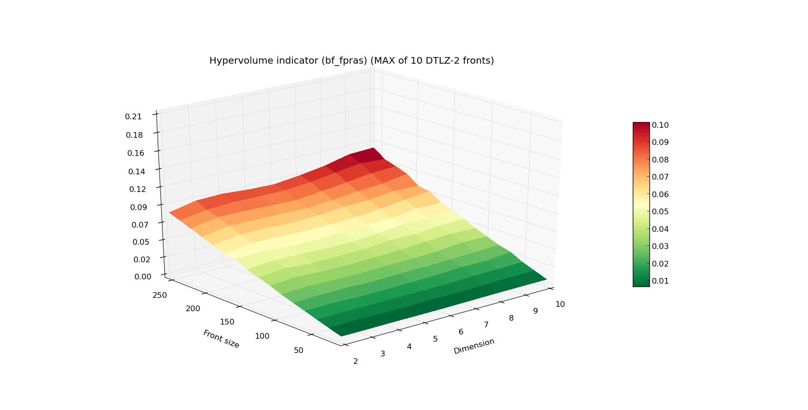

.. _approximating_the_hypervolume:

================================================================
Approximating the hypervolume
================================================================

Determining the hypervolume indicator is a computationally expensive task.
Even in case of a reasonably small dimension and low number of points (e.g. 100 points in 10 dimensions), there are currently no known algorithms that can yield the results fast enough for most multiple-objective optimizers.

In this tutorial we will show a way to compute the hypervolume indicator faster, but at the cost of accuracy.
Two algorithms found in `PyGMO.util.hv_algorithm` are capable of computing the hypervolume approximately:

#. `PyGMO.util.hv_algorithm.bf_fpras` - capable of approximating the hypervolume indicator
#. `PyGMO.util.hv_algorithm.bf_approx` - capable of approximating the least and the greatest contributor

.. note::
 `PyGMO.util.hypervolume` object will never delegate the computation to any of the approximated algorithms.
 The only way to use the approximated algorithms is through the explicit request (see the beginning of the tutorial :ref:`advanced_hypervolume_computation_and_analysis` for more information on how to do that).

FPRAS
================

Algorithm `PyGMO.util.hv_algorithm.bf_fpras` found in PyGMO is a Fully Polynomial-Time Randomized Approximation Scheme accustomed for the computation of the hypervolume indicator. You can invoke the FPRAS by creating an instance of the hv_algorithm:

.. code-block:: python

  from PyGMO import *
  from PyGMO.util import *
  prob = problem.dtlz(prob_id = 3, fdim=10)
  pop = population(prob, 100)
  fpras = hv_algorithm.bf_fpras(eps=0.1, delta=0.1)
  hv = hypervolume(pop)
  ref = hv.get_nadir_point(1.0)
  hv.compute(ref, algorithm=fpras)  # Will compute the approximated hypervolume

To influence the accuracy of the FPRAS, it is possible to provide the following keyword arguments to its constructor:

#. *eps* - relative accuracy of the approximation
#. *delta* - probability of error

For given parameters **eps=eps0** and **delta=delta0**, the obtained solution is (with probability **1 - delta0**) within a factor of **1 +/- eps0** from the exact hypervolume.

.. note::
 The smaller the **eps** and **delta**, the longer it will take for the algorithm to evaluate.

By the *relative* error, we mean the scenario in which the approximation is accurate within given order of magnitude, e.g. 312.32 and 313.41, are accurate within **eps = 0.1**, because they are accurate within two orders of magnitude. At the same time, these are NOT accurate within **eps = 0.01**.

Running time
------------------

Plot below presents the measured running time (average and MAX out of 10) of FPRAS for varying ``Front size`` and ``Dimension``.
The algorithm was instantiated with **eps=0.1** and **delta=0.1**.
Notice the lack of any exponential increase in time as the dimension increases.

Since FPRAS scales so well with the dimension size, let us present a more extreme example of fronts for which we again will measure the execution time:

.. image:: ../images/tutorials/hv_fpras_extreme.png
  :width: 850px

Now, that is quite a feat! A front of 1000 points in 100 dimensions is beyond the reach of the algorithms that rely on the exact computation.

Approximation of the least contributor
==========================================

Additionally to FPRAS, PyGMO provides an approximated algorithm dedicated for the computation of the least/greatest contributor.
This is useful when we want to utilize evolutionary algorithms which rely on that feature, especially when the problems has many objectives.

.. code-block:: python

  from PyGMO import *
  from PyGMO.util import *
  # Problem with 30 objectives and 300 individuals
  prob = problem.dtlz(prob_id = 3, fdim=30)
  pop = population(prob, 300)

  alg = hv_algorithm.bf_approx(eps=0.1, delta=0.1)
  hv = hypervolume(pop)
  ref = hv.get_nadir_point(1.0)
  hv.least_contributor(ref, algorithm=alg)  # Will compute the approximated least contributor

.. note::
 Algorithm bf_approx provides only two features - computation of the least and the greatest contributor. Request for the computation of any other measure will raise and exception.
