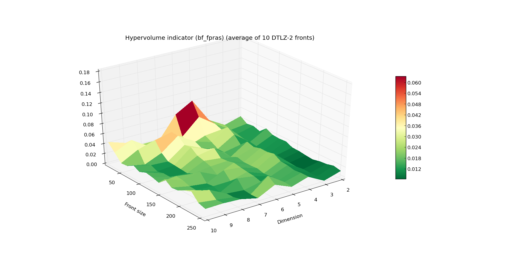

.. _approximating_the_hypervolume:

================================================================
Approximating the hypervolume
================================================================

Determining the hypervolume indicator is a computationally-heavy task.
Even in case of a reasonably small dimension size and number of points (e.g. 100 points in 10 dimensions), there are no known algorithms that can yield the results fast enough for multiple-objective optimizers.

In this tutorial we will show a way to compute the hypervolume indicator faster, at the cost of accuracy.
Two algorithms found in `PyGMO.hv_algorithm` are capable of computing the hypervolume approximately:

#. `PyGMO.hv_algorithm.bf_fpras` - capable of approximating the hypervolume indicator
#. `PyGMO.hv_algorithm.bf_approx` - capable of approximating the least and the greatest contributor

**Note**: `PyGMO.hypervolume` object will never delegate the computation to any of the approximated algorithms.
The only way to use the approximated algorithms is though the explicit request (see the beginning of the tutorial :ref:`advanced_hypervolume_computation_and_analysis` for more information on how to do that).
Here, in just under 3 seconds, you can approximate the answer to these as well.

FPRAS
================

Algorithm `PyGMO.hv_algorithm.bf_fpras` found in PyGMO is an implementation of FPRAS (Fully Polynomial-Time Randomized Approximation Scheme) accustomed for the computation of the hypervolume problems.
You can invoke the algorithm by creating an instance of the algorithm:

.. code-block:: python

  from PyGMO import *
  prob = problem.dtlz3(fdim=10)
  pop = population(prob, 100)
  fpras = hv_algorithm.bf_fpras(eps=0.1, delta=0.1)
  hv = hypervolume(pop)
  ref = hv.get_nadir_point(1.0)
  hv.compute(ref, algorithm=fpras)  # Will compute the approximated hypervolume

Since many approximated algorithms based on the Monte Carlo approach allow for some customization, it is possible to provide the following keyword arguments to the constructor of `hv_algorithm.bf_fpras`:

#. *eps* - relative accuracy of the approximation
#. *delta* - probability of error

First parameter (**eps**) decides how accurate the approximation aims to be.
The smaller the epsilon, the longer it will take for the algorithm to evaluate.
Parameter **delta** models the uncertainty of the approximation, e.g. for given **eps0** and **delta0** we are **1 - delta0** certain that the obtained answer is relatively no further from the exact hypervolume by **eps0**.

By the *relative* error, we mean the scenario in which the approximation is accurate within given order of magnitude, e.g. 312.32 and 313.41, are accurate within **eps = 0.1**, because they are accurate within two orders of magnitude. At the same time, these are NOT accurate within **eps = 0.01**.

Running time
------------------

Plot below presents the measured running time (average and MAX out of 10) of FPRAS for varying **Front size** and **Dimension**.
The algorithm was instantiated with **eps=0.1** and **delta=0.1**.
Notice the lack of any significant increase in time as the dimension increases.

.. image:: ../images/tutorials/hv_compute_fpras_runtime.png
  :width: 850px

.. image:: ../images/tutorials/hv_MAX_compute_fpras_runtime.png
  :width: 850px

Since FPRAS scales so well with the dimension size, let us present a more extreme example of fronts for which we again will measure the execution time:

.. image:: ../images/tutorials/hv_fpras_extreme.png
  :width: 850px

Now, that is quite a feat! A front of 1000 points in 100 dimensions is an impossible case even for the state of the art algorithms that rely on the exact computation.

Accuracy
-----------------

This experiment measures the accuracy of the `PyGMO.hv_algorithm.bf_fpras` algorithm.
Plot below describe the relative accuracy of FPRAS and exact hypervolume methods.
Z axis is the average accuracy, computed over ten DTLZ-2 fronts.

Bringmann-Friedrich approximation for the least contributor
===========================================================

Running time
------------------

Accuracy
-----------------
