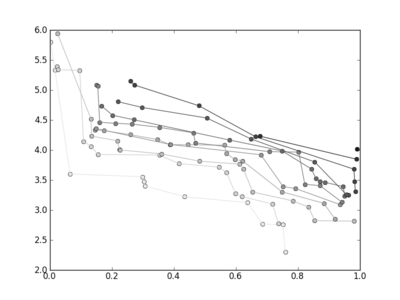
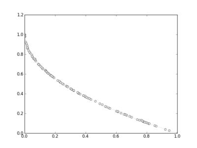

.. _basic_mo_functionalities:

================================================================
Basic Multi-Objective Functionalities
================================================================

In this tutorial we will learn how to use PyGMO to solve multiple-objective
optimization problems. In essence we will learn how to use the methods that deal with 
Pareto-optimality, in particular those of the class *population* 

This tutorial assumes an ipython interactive environment.
Let us start to define our population:

.. code-block:: python
   
   In [1]: from PyGMO import *
   In [2]: prob = problem.zdt(1)
   In [3]: pop = population(prob,10)

We here make use of first problem of the ZDT benchmark suite and we created a *population* containing 10 individuals randomly created within the box bounds. Which individuals belong to which preto front? We can immediately see this by typing:

.. code-block:: python
   
   In [4]: pop.compute_pareto_fronts()
   Out[4]: ((0, 1, 6), (2, 5, 7), (4,), (8, 9), (3,))

For larger populations, a good visualization of the different Pareto Fronts can be obtained:

.. code-block:: python
   
   In [5]: pop = population(prob,100)
   In [6]: pop.plot_pareto_fronts()

which will produce a plot similar to:

where each successive pareto front is plotted in darker colour. If we now type:

.. code-block:: python
   
   In [7]: algo = algorithm.nsga_II(gen = 250)
   In [8]: pop = algo.evolve(pop)
   In [9]: pop.plot_pareto_fronts()

we have instantiated the algorithm Non-dominated Sorting Genetic Algorithm, able to tackle
multi-objective problems, defining the number of generations to 250. In the next line use directly
the method evolve of the algorithm to evolve the *population*. 
We could have also, similarly, defined an island and use the evolve method of the island:

.. code-block:: python
   
   In [7]: algo = algorithm.nsga_II(gen = 250)
   In [8]: isl = island(algo,pop)
   In [9]: isl.evolve(1)
   In [10]: isl.population.plot_pareto_fronts()

This block of code is equivalent to the previous one showing how, in PyGMO, islands are not necessary to run algorithms in single threads. They only become really necessary
in connection to archipelago evolutions. In any case at the end of our evolution we may plot again the pareto
front:

   In [10]: pop.plot_pareto_fronts()

to finally have:

