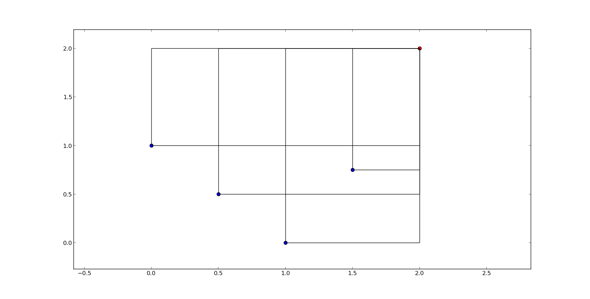

.. _getting_started_with_hyper_volumes:

================================================================
Getting started with hypervolumes
================================================================

This tutorial will cover the features introduced by the hypervolume computation features of PyGMO.
First we will describe how the user interface to hypervolume computation was designed, and point out important notions that ought to be taken into account.
Later, we will go over several examples, in order to get you started with the hypervolume computation.

Hypervolume Interface and Construction
======================================

Main class used for the computation of the hypervolume indicator (also known as Lebesgue Measure or S-Metric) and other measures that derive from it, is the `PyGMO.util.hypervolume` class.
You can import the hypervolume features using the following:

.. code-block:: python

  from PyGMO.util import hypervolume
  'hypervolume' in dir()  # Returns True
    
Since whole feature of the computation of hypervolume is bound tightly to many optimization algorithms, we provide two constructors for the hypervolume object.
The first one uses the fitness values of the individuals of a population as a point set:

.. code-block:: python

  from PyGMO import *

  prob = problem.dtlz2(fdim=3)  # Construct DTLZ-2 problem with 3-dimensional fitness space
  pop = population(prob, 50)  # Construct the population object
  hv = hypervolume(pop)  # Construct the hypervolume object from the population object
  
Second method uses and explicit representation of coordinates as point set:

.. code-block:: python

  from PyGMO import *

  hv = hypervolume([[1,0],[0.5,0.5],[0,1]])

This type of explicit constructor is especially useful when the problem at hand is outside of the scope of the optimization framework.

Computing the hypervolume indicator and other features
======================================================

Before we give an overview of each hypervolume feature, let us discuss the assumptions we make regarding the reference point, and the set of points in general:

1. We assume **minimization** in every dimension, that is, a reference point is required to be numerically larger or equal in each objective, and strictly larger in at least one of them.
2. Although the hypervolume for one dimension is well defined mathematically, we require any input data to have a matching dimensionality of least 2-dimensional, including the reference point.

For simplicity, we will support every example below based on this simple 2-dimensional front:

.. code-block:: python

  from PyGMO import *

  hv = hypervolume( ((1, 0), (0.5, 0.5), (0, 1), (1.5, 0.75)) )
  ref_point = (2,2)
  hv.compute(r=ref_point)  # Returns 3.25 as an answer

We will refer to each point by it's position on X axis, e.g. first point is the point (0,1), fourth point is (1.5, 0.75) etc.

Once the hypervolume object is created, it allows for the computation of the following figures:

1. **compute** - Returns the joint hypervolume of the set of points (S-Metric).

.. code-block:: python

  # hv and ref_point refer to the data above
  hv.compute(r=ref_point)  # Returns 3.25 as an answer

2. **exclusive** - Returns the exclusive hypervolume by the point at given index (indexing starts at 0).

.. code-block:: python

  # hv and ref_point refer to the data above
  hv.exclusive(1, r=ref_point)  # Returns 0.25 as an answer
  hv.exclusive(3, r=ref_point)  # Returns 0.0 as an answer since third point is dominated

3. **least_contributor** - Returns the index of the point contributing the least to the hypervolume.

.. code-block:: python

  # hv and ref_point refer to the data above
  hv.least_contributor(r=ref_point)  # Returns 3 as an answer, since third point contributes no hypervolume

4. **greatest_contributor** - Returns the index of the point contributing the most to the hypervolume.

.. code-block:: python

  # hv and ref_point refer to the data above
  hv.greatest_contributor(r=ref_point)  # Returns either 0 or 2 as an answer

**Note:** In case of several least/greatest contributors, PyGMO returns only one contributor out of all candidates arbitrarily.

5. **contributions** - Returns a list of contributions for each of the point in a set.
  This should return the same results as the successive call to the *exclusive* method for each of the points.
  Due to implementation details, explicit request for all contributions at once may be much faster (in the best case by the *O(n)* time) than computing each contribution using the *exclusive* method.

.. code-block:: python

  # hv and ref_point refer to the data above
  hv.contributions(r=ref_point)  # Returns a tuple (0.5, 0.25, 0.5, 0.0)

Since all of the methods above require a reference point, it is often useful to generate one automatically:

6. **get_nadir_point** - Generates a point that is "worst" than any other point in each of the objectives.
   By default, it generates a point whose objectives are the minima among objectives for the whole set.
   Additionally, it is possible to provide an offset which is added to each objective of the reference point.
   This way any point sharing the "worst" value for given objective with the reference point, is not automatically contributing 0 hypervolume.

Short script below will present the features mentioned above on a concrete example:

.. code-block:: python

  from PyGMO import *

  # Initiate the 4-objective problem
  # and a population of 100 individuals
  prob = problem.dtlz4(fdim=4)
  pop = population(prob, 100)

  # Construct the hypervolume object
  # and get the reference point off-setted by 1.0 in each objective
  hv = hypervolume(pop)
  ref_point = hv.get_nadir_point(1.0)

  print hv.compute(r=ref_point)
  print hv.exclusive(p_idx=0, r=ref_point)
  print hv.least_contributor(r=ref_point)
  print hv.greatest_contributor(r=ref_point)
  print hv.contributions(r=ref_point)

  # Evolve the population a little bit
  algo = algorithm.sms_emoa(gen=100)
  for _ in xrange(10):
    pop = algo.evolve(pop)

  # Measure the quality again
  # This time we can expect the higher value for the hypervolume,
  # as SMS-EMOA evolves the population, by trying to maximize the hypervolume indicator.
  hv = hypervolume(pop)
  ref_point = hv.get_nadir_point(1.0)
  print hv.compute(r=ref_point)
