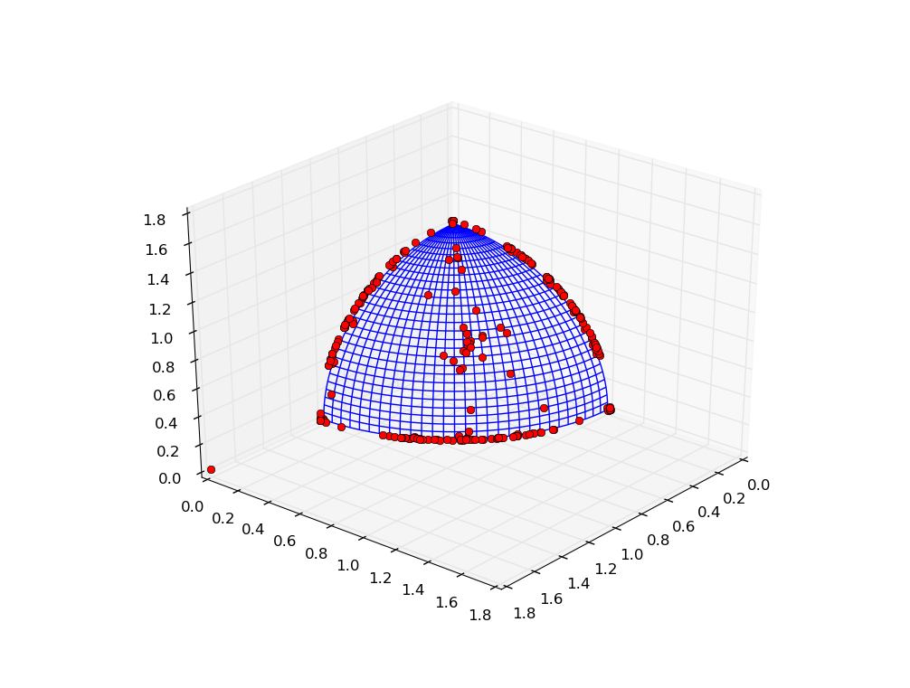
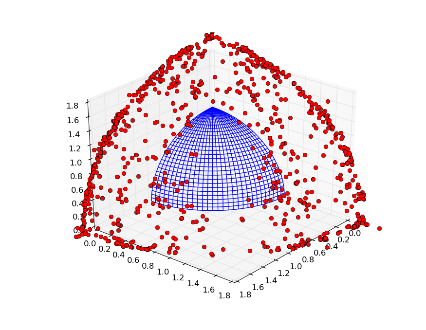
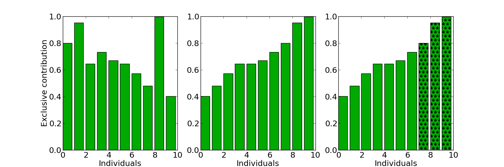
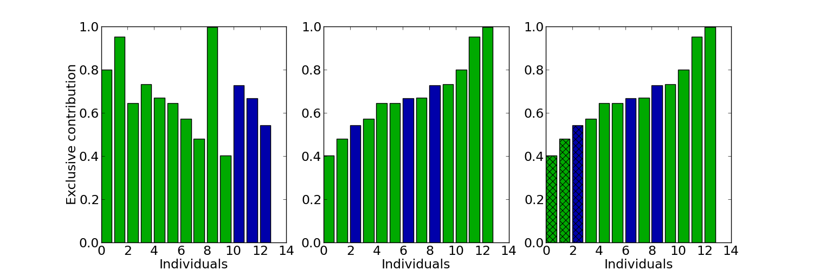

.. _migration_based_on_hypervolumes:

================================================================
Migration based on hypervolume contribution
================================================================

In this tutorial we will cover some migration strategies that are based on the hypervolume computation.
There are in total 4 migration policies which are based on the hypervolume feature.

#. `PyGMO.migration.hv_greedy_s_policy`
#. `PyGMO.migration.hv_greedy_r_policy`
#. `PyGMO.migration.hv_best_s_policy`
#. `PyGMO.migration.hv_fair_r_policy`

For more information on migration policies, please visit the corresponding documentation page on :ref:`migration`.

Code below establishes an archipelago with the SMS-EMOA algorithm, using the `PyGMO.migration.hv_best_s_policy` and `PyGMO.migration.hv_fair_r_policy`.
As a comparison, the random migration policies `PyGMO.migration.random_s_policy` and `PyGMO.migration.random_r_policy` are also employed for the task.

.. code-block:: python

    from PyGMO import *
    from PyGMO.util import *

    def run_evolution(islands, prob):
        """
        Creates archipelago and proceeds with the evolution
        """

        # Create the archipelago, and push the islands
        arch = archipelago(topology=topology.fully_connected())
        for isl in islands:
            arch.push_back(isl)
    
        # Evolve for 130 steps
        n_steps = 130
        for s in xrange(n_steps):
            print "Evolving archipelago, step %d/%d" % (s, n_steps)
            arch.evolve(1)

        # Merge all populations across the islands together
        pop = population(prob)
        for isl in arch:
            for ind in isl.population:
                pop.push_back(ind.cur_x)
    
        print "Final P-Distance: ", prob.p_distance(pop)
        prob.plot(pop)
  
    def main():
        # Set up problem as DTLZ-3 with 3 objectives and the algorithm as SMS-EMOA
        prob = problem.dtlz(prob_id=3, fdim=3)
        alg = algorithm.sms_emoa(gen = 100)

        # Construct the hv_best/fair migration policies
        s_pol = migration.hv_best_s_policy(0.15, migration.rate_type.fractional)
        r_pol = migration.hv_fair_r_policy(0.15, migration.rate_type.fractional)

        # Construct the random policies
        r_s_pol = migration.random_s_policy(0.15, migration.rate_type.fractional)
        r_r_pol = migration.random_r_policy(0.15, migration.rate_type.fractional)

        # Set up the archipelago
        n_islands = 16
        n_individuals = 64

        # Create and evolve the archipelago using the hypervolume-based migration policies
        isls_hv = [island(alg, prob, n_individuals, s_policy=s_pol, r_policy=r_pol) for i in xrange(n_islands)]
        run_evolution(isls_hv, prob)

        # Create and evolve the archipelago using the random migration policies
        isls_rnd = [island(alg, prob, n_individuals, s_policy=r_s_pol, r_policy=r_r_pol) for i in xrange(n_islands)]
        run_evolution(isls_rnd, prob)

    if __name__ == "__main__":
        main()

.. note::
 You can save the code above, and execute it by issuing the following in the command line: **python tutorial.py** (assuming the first argument is the name of the file).

After 130 evolutionary steps, the first scenario produces a population which has converged to a solution not far from the true pareto front.
The plot below is a result of the evolution of an archipelago using the hypervolume-based migration policies:

In case of the random migration policies, the individuals are still far from the optimal front, which suggests that the hypervolume-based migration policies might have helped in the establishing of the good solution.
Plot below is a result of the evolution of an archipelago using the random migration policies:

How does the migration work ?
=============================

We owe you an explanation on what had happened behind the curtains of that archipelago migration.
A main advantage of evolving an archipelago are the occasional migrations: individuals spreading from one island to a neighbouring island.
The island to which the individuals have travelled is able to pick and choose the newly arrived immigrants, and use the information stored in their chromosome to advance the evolution further.

Hypervolume computation plays a significant role in establishing the *best* subset of individuals (these are the candidates for emigration), as well as the *worst* subset (which may be replaced by available set of immigrants).
In our example, the selection and replacement of individuals by using the hypervolume allows a faster convergence (= less function evaluations) towards the Pareto-front than the random migration strategy.

Hypervolume-based selection policy
----------------------------------

Let us assume an island with 10 individuals. We want to determine a set of 4 emigrants (outgoing individuals).
First step is computing the contributions of each individual according to some valid reference point.
After this we select the 4 individuals that contributed the most.
The plot on the left visualizes the computed exclusive contributions of 10 individuals.
On the right are the same individuals ordered ascending by their contribution.
The last four individuals in this ordering are selected for migration.

This example describes almost exactly what happens in `PyGMO.migration.hv_best_s_policy`.
The main difference in what hypervolume-based "best" policy does is that it computes the contributions *per-front*, starting from the first one, opposed to compute the contributions for the whole population in a single call.
This is mainly a precaution for selecting the best emigrants possible in the early stages of the algorithm, when we expect several different fronts.
Since the points with higher front ranks are dominated (and thus having a contribution of zero) we could not give a preference beyond the individuals of the first front for selection.

To avoid this problem, we first compute the contributions among the individuals in the first front.
If there are more individuals requested as available in the first front, we remove it temporarily from the population, recompute contributions of the population and continue to fill up the list of emigrants with the greatest contributors from the original second front and so on.
This process continues until we have selected the requested number of emigrants.

Although the general idea of `PyGMO.migration.hv_greedy_s_policy` is the same, there is one main difference.
Instead of computing the contributions of all individuals at once (see `PyGMO.util.hypervolume.contributions`), we iteratively compute the *single* greatest contributor (see `PyGMO.util.hypervolume.greatest_contributor`).
After the greatest contributor was found, we temporarily remove it from the population (which most likely will change the contributions from other points) and compute the new greatest contributor to select the second emigrant and so on.

Hypervolume-based replacement policy
------------------------------------

The hypervolume replacement policies work in a similar fashion, except this time the least contributing islanders are computed and replaced by the highest contributing immigrants, if any. The plot on the left visualizes a population of 10 islanders (green) merged together with 5 immigrants (blue).
In this set of 15 individuals, we determine the 5 least contributors, either by computing all contributions at once (`PyGMO.migration.hv_fair_r_policy`) or iteratively (`PyGMO.migration.hv_greedy_r_policy`) by removing each least contributor (`PyGMO.util.hypervolume.least_contributor`) once it was established.
The plot on the right visualizes the ordered population, out of which 5 least contributors were selected.
Since there are 3 islanders in the set of 5 least contributors, it is possible to make 3 fair replacements: 3 *discarded* islanders (crossed-over bar) with 3 *non-discarded* immigrants.

.. note::
 The *per-front* policy also applies here. Least contributors are established first from the **last** front of the population, progressing upwards to the individuals in the first front.

Before we merge immigrants and islanders, there is a preprocessing step where duplicated individuals are filtered out.
If a given immigrant is already on the island, we would like to make sure it is not added to the population to avoid unnecessary computations. If this happens, the immigrant is no longer considered as a candidate for replacing an islander and gets discarded.
