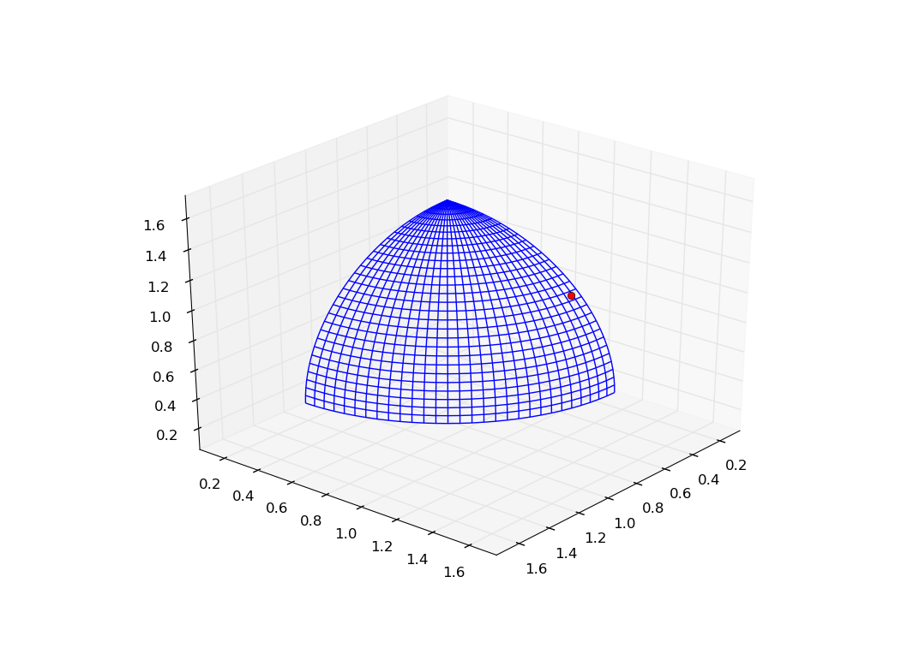

.. _migration_based_on_hypervolumes:

================================================================
Migration based on hypervolume contribution
================================================================

In this tutorial we will cover some migration strategies that are based on the hypervolume computation.
There are in total 4 migration policies which are based on the hypervolume feature.

#. `PyGMO.migration.hv_greedy_s_policy`
#. `PyGMO.migration.hv_greedy_r_policy`
#. `PyGMO.migration.hv_best_s_policy`
#. `PyGMO.migration.hv_fair_r_policy`

In general, migration policy is a intermediate step in the archipelago evolution, which assigns a certain ordering to individuals on given island in order to establish the best/worst subset of the population.
Information about the subsets is later used for the selection of the "best" individuals, as well as for the replacement of the inferior subset with a subset from another island.
Migration based on hypervolume use the exclusive contribution feature to establish the ordering of individuals.

Code below establishes an archipelago with SMS-EMOA algorithm, and the hv_best_s/hv_fair_r migration policies.
The topology of the archipelago is either `PyGMO.topology.fully_connected` - direct migration is possible between any two islands, or `PyGMO.topology.unconnected`, which leaves the migration virtually non-existing.

.. code-block:: python

  # Set up problem as DTLZ-3 with 3 objectives, evolved using SMS-EMOA
  prob = problem.dtlz3(fdim=3)
  alg = algorithm.sms_emoa(gen = 100)
  
  # Construct the hv_best/fair migration policies
  s_pol = migration.hv_best_s_policy(0.25, migration.rate_type.fractional)
  r_pol = migration.hv_fair_r_policy(0.25, migration.rate_type.fractional)
  
  # Set up the archipelago
  n_islands = 16
  n_individuals = 16

  # Swap the comment between lines below to use the unconnected topology
  #top = topology.unconnected()
  top = topology.fully_connected()

  arch = archipelago(topology=top)
  isls = [island(alg, prob, n_individuals, s_policy=s_pol, r_policy=r_pol) for i in xrange(n_islands)]
  for isl in isls:
  	arch.push_back(isl)
  
  # Evolve
  n_steps = 50
  for s in xrange(n_steps):
  	arch.evolve(1)
  
  # Merge all populations across the islands together
  pop = population(prob)
  for isl in arch:
  	for ind in isl.population:
  		pop.push_back(ind.cur_x)
  
  print prob.p_distance(pop)
  prob.plot(pop)

After 50 evolutionary steps, the first scenario produces a population which have converged to a proper solution, not far from the pareto front.
The plot below is a result of the evolution with a fully connected topology:

.. image:: ../images/tutorials/hv_best_fair_migration_policy.png
  :width: 750px

In case of unconnected topology, the individuals are still far from the optimal front, which suggests that the migration policy might have helped in the establishing of the good solution.
Plot below is a result of the evolution with no connections between the islands.

