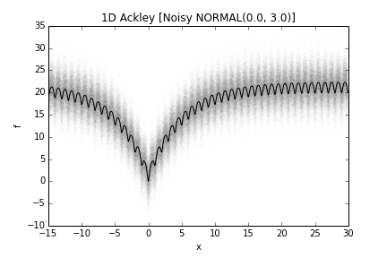
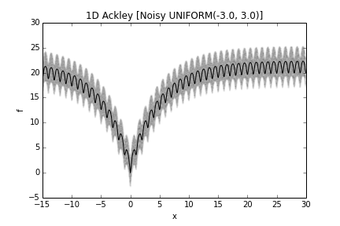
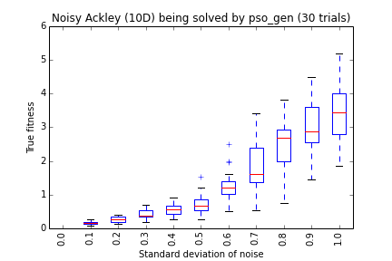
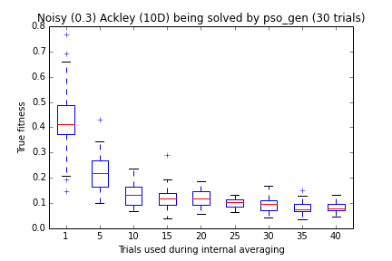

.. _noisy:

=======================================================================
The Noisy meta-problem
=======================================================================

The noisy meta-problem introduces noise into regular PyGMO problem, rendering
them stochastic. More specifically, the observed fitness and constraint vectors
from such problems have been corrupted by noises. Currently, two types of noise
distributions are supported, namely the normal distribution and uniform
distribution.

.. code:: python

    from PyGMO import *
    prob = problem.ackley(1)
    prob_noisy_normal = problem.noisy(prob, trials=1, param_first=0.0, param_second=0.1, noise_type=problem.noisy.noise_distribution.NORMAL)
    prob_noisy_uniform = problem.noisy(prob, trials=1, param_first=-3, param_second=3, noise_type=problem.noisy_noise_distribution.UNIFORM)

The construction parameters control the following aspects of the noisy transform:

* **Noise distribution:** The Gaussian noise is characterized by a mean of
  ``param_first`` and a standard deviation of ``param_second``, while the
  uniformly noise is uniformly distributed between ``param_first`` and
  ``param_second``.

* **Internal averaging:** The noisy meta-problem provides an internal mechanism
  to perform averaging via repeated evaluation before reporting the fitness /
  constraint vectors, at the expense of increase computational budget. The
  number of samples to average over is controlled by the parameter ``trials``.

The fitness landscape (or more precisely the distribution of fitness values at
each decision value) of a noisy one-dimensional Ackley problem is visualized in
the following figures.  The solid line is the fitness in case of a noise-less
problem.

The transformed problem becomes stochastic. It can be solved by optimizers
capable of handling stochastic problems, for example ``pso_gen``. The quality
of a solution can be assessed by the noise-less version of the problem, serving
as the ground truth information.

As some examples, let's apply ``pso_gen`` to different version of noisy
problems. Generally, the larger the magnitude of noise, the harder the problem
becomes. Increasing the ``trials`` parameter reduces the adversarial effect of
noise.

