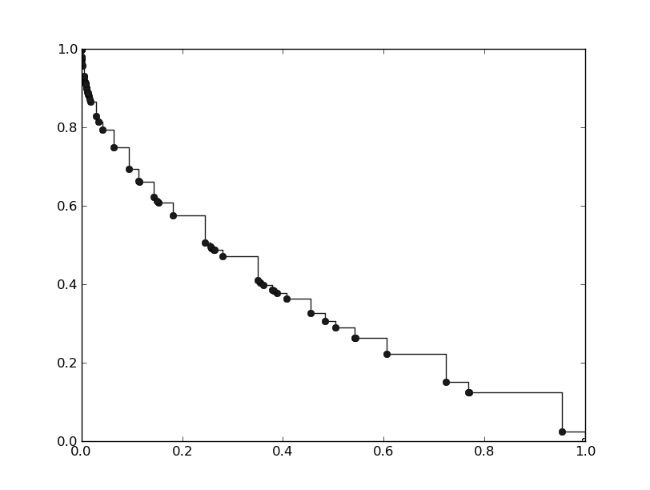
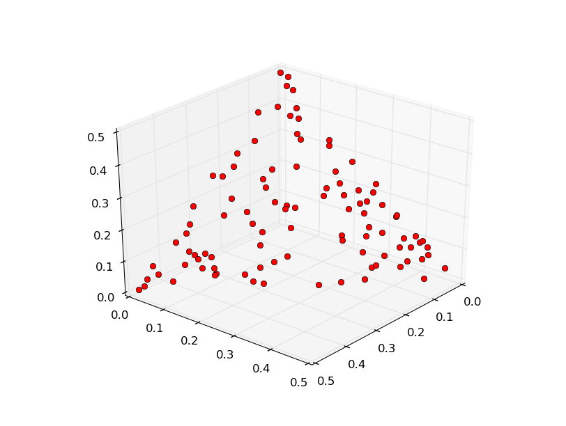
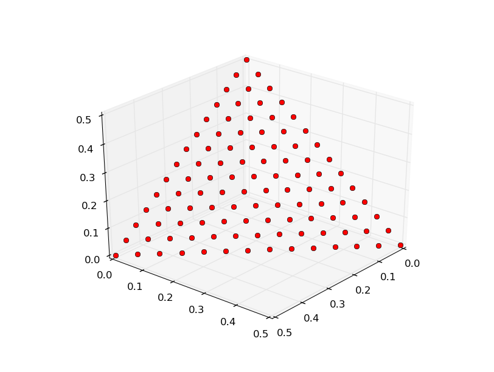
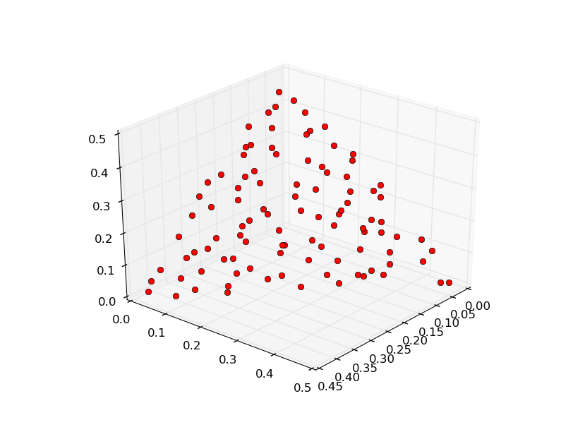

.. _pade_a_moea_d_algorithm:

================================================================
PADE: a parallel MOEA-D algorithm
================================================================

In this tutorial we will learn how to use PADE to solve a multi-objective problem. PADE transforms a multi-objective problem into N single-objective ones, where N is the population size. It does that using the :ref:`decomposition` meta problem. It then solve each problem in parallel using a given single objective algorithm. The population provided at the end of the evolution will be the union of the solutions to each single-objective problem.

Let start using PADE to solve the popular multi-objective benchmark problem ZDT1.

.. code-block:: python

	In [1]: from PyGMO import *
	In [2]: prob = problem.zdt(1)
	In [3]: alg = algorithm.pade()
	In [4]: pop = population(prob, 100)
	In [5]: pop = alg.evolve(pop)
	In [6]: pop.plot_pareto_fronts()

We will get the following

Each point on the pareto front corresponds to the solution to a single-objective problem. In order for the point to be well spread is then crucial to choose the proper decomposition method and the proper weight vectors. It is possible to do that as follow

.. code-block:: python

	In [7]: alg = algorithm.pade(decomposition = problem.decompose.BI, weights=algorithm.pade.GRID)
	In [8]: pop = alg.evolve(pop)
	In [9]: pop.plot_pareto_fronts()

.. image:: ../images/tutorials/pade/bi_grid_zdt1.png
    :width: 500pt

As we can see the points on the pareto front are much better spread.

In the following plots we see how different weight generation methods perform on the 3-objective benchmark problem DTLZ1. First we will use a RANDOM weight generation.

.. code-block:: python

	In [1]: from PyGMO import *
	In [2]: alg = algorithm.pade(decomposition = problem.decompose.BI, weights=algorithm.pade.RANDOM)
	In [3]: prob = problem.dtlz(1)
	In [4]: pop = population(prob,100)
	In [5]: pop = alg.evolve(pop)
	In [6]: prob.plot(pop)

Let's now try generating the weight vectors with the GRID method

.. code-block:: python

	In [7]: alg = algorithm.pade(decomposition = problem.decompose.BI, weights=algorithm.pade.GRID)
	In [8]: pop = population(prob,100)
	In [9]: pop = alg.evolve(pop)
	---------------------------------------------------------------------------
	ValueError                                Traceback (most recent call last)
	<ipython-input-10-1eb0f083e7c3> in <module>()
	----> 1 pop = alg.evolve(pop)

	ValueError: /home/mambro/qtcreator_workspace/pagmo-code/src/algorithm/pade.cpp,183: Invalid population size. Select 91 or 105..

As we can see from the error message we cannot use any population size. The error message will suggest us the two accepted values closer to the one we wanted. Let's then choose 105.

.. code-block:: python

	In [10]: pop = population(prob,105)
	In [11]: pop = alg.evolve(pop)
	In [12]: prob.plot(pop)

As we can see the front is much better spread. The only drawback of the GRID method is that we are not free to choose any population size. To have a better spread than the one obtained with the RANDOM method but still be able to choose any population size, we can use the LOW_DISCREPANCY method.

.. code-block:: python

	In [13]: alg = algorithm.pade(decomposition = problem.decompose.BI, weights=algorithm.pade.LOW_DISCREPANCY)
	In [14]: pop = population(prob,100)
	In [15]: pop = alg.evolve(pop)
	In [16]: prob.plot(pop)

We now introduce two more interesting features of PADE. 

It is possible to choose which single-objective algorithm to use to solve each single-objective problem the original problem is decomposed into, in the following way

.. code-block:: python

	In [1]: alg = algorithm.pade(solver = algorithm.jde(50))

Moreover, as said at the beginning of the tutorial, PADE solves the single-objective problems in parallel. It is possible to set how many threads to run. This should be ideally equal to the number of logic cores available in the machine which runs the code.

.. code-block:: python

	In [2]: alg = algorithm.pade(max_parallelism = 8)
