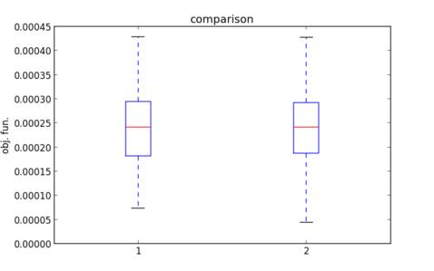
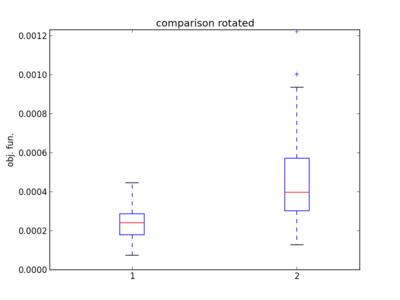

.. _rotated_shifted:

================================================================
Rotated and Shifted problems
================================================================

In this tutorial we will learn how to use meta-problems. These are optimization problems that transform somehow
another optimization problem. In particular we will have a look to the rotated and shifted meta-problems.
Let us start creating a shifted problem.

.. code-block:: python
   
   In [1]: from PyGMO import *
   In [2]: prob = problem.ackley(5)
   In [3]: shifted_prob1 = problem.shifted(problem=prob)
   In [4]: shifted_prob2 = problem.shifted(problem=prob,shift=15)
   In [5]: shifted_prob3 = problem.shifted(problem=prob,shift=[23,-12.2,22,33,5.3])

We have used three different constructors to instantiate the new problem with a random shift vector (shifted_prob1),
with a uniform shift vector (shifted_prob2) and with a fully defined shift vector (shifted_prob3). In all
cases we may extract the shift vector using the corresponding attribute

.. code-block:: python
   
   In [4]: shift1 = shifted_prob1.shift_vector
   Out[11]: (22.05074397709721, 42.30378775731836, 41.28781073553851, -37.032452729545746, -43.15424830101163)

We may now check that such a shift does not change the performance of a given algorithm. We choose,
for this tutorial Improved Harmony Search, but you can try changing it to test others.

.. code-block:: python
   
   In [5]:  l = list()
   In [6]:  algo = algorithm.ihs(1000); 
   In [7]:  for i in range(100):
                pop = population(prob,20)
                for i in range(15):
                    pop = algo.evolve(pop)
                l.append(pop.champion.f[0])
   In [8]:  l_shift = list()
   In [9]:  for i in range(100):
                pop = population(shifted_prob1,20)
                for i in range(15):
                    pop = algo.evolve(pop)
                l_shift.append(pop.champion.f[0])
   In [10]: boxplot([l,l_shift])
   
which will produce a plot similar to:

where one can clearly see how the algorithm ihs does not change its performances when the search space is shifted.

We now repeat the same procedure for a rotated problem.

.. code-block:: python
   
   In [1]: from PyGMO import *
   In [2]: prob = problem.ackley(5)
   In [3]: shifted_prob = problem.rotated(problem=prob)

Also in the case of the rotated problem the kwarg rotation allows to pass a rotation matrix directly, otherwise a random 
orthonormal matrix will be generated and can be extracted by the problem.rotation attribute.

Running the same procedure as for the shifted problem returns a picture like the one below.

Which clearly indicates how the rotation affects negatively the algorithm performance.

Note that meta-problems can be nested together, so it is perfectly valid to have

.. code-block:: python

   In [1]: from PyGMO import *
   In [2]: prob = problem.ackley(5)
   In [3]: new_prob = problem.rotated(problem.shifted(problem.rotated(prob)))
   
To make sure one can reconstruct the original problem, the transformations applied are logged in the problem __repr__ method

.. code-block:: python

   In [4]: print new_prob
   Out[4]:
   Problem name: Ackley [Rotated] [Shifted] [Rotated]
        Global dimension:                       5
        Integer dimension:                      0
        Fitness dimension:                      1
        Constraints dimension:                  0
        Inequality constraints dimension:       0
        Lower bounds: [-1.4142135623730951, -1.4142135623730951, -1.4142135623730951, -1.4142135623730951, -1.4142135623730951]
        Upper bounds: [1.4142135623730951, 1.4142135623730951, 1.4142135623730951, 1.4142135623730951, 1.4142135623730951]
        Constraints tolerance:                  0

        Rotation matrix: 
   -0.599649   0.20824 0.0152832 -0.740073 -0.221622
   -0.263871 -0.341942  0.873749  0.072256  0.211634
   -0.114375 -0.709787 -0.157299 0.0906273 -0.670943
   0.663241  0.209505  0.425168 -0.326385 -0.478461
   0.343255 -0.540391  -0.17555 -0.576482  0.476451

        Shift vector: [-2.5281990225671565, 2.2507667730831695, 2.260031719866459, -2.6037537655145679, -0.45739118339223306]

        Rotation matrix: 
   -0.469888  -0.334498  -0.813054  0.0761044 -0.0216481
   -0.416312  -0.467594   0.372853  -0.513315   0.453352
    0.413702  0.0719025  -0.277365   0.149243   0.851161
    0.182474   0.391322  -0.341818  -0.830096 -0.0875853
   -0.633596   0.714957  0.0784432   0.139221    0.24871

