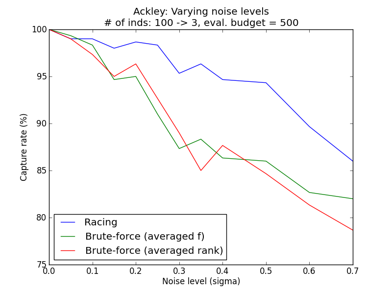
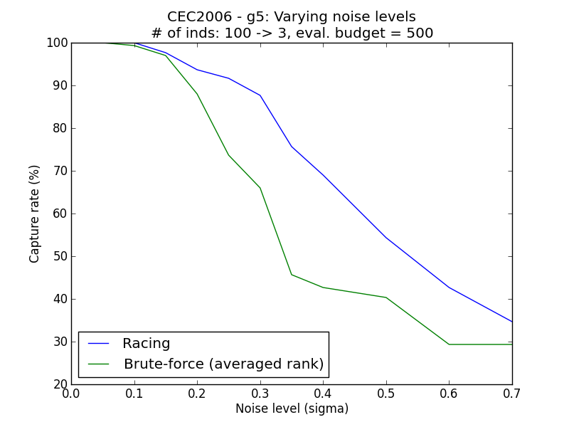
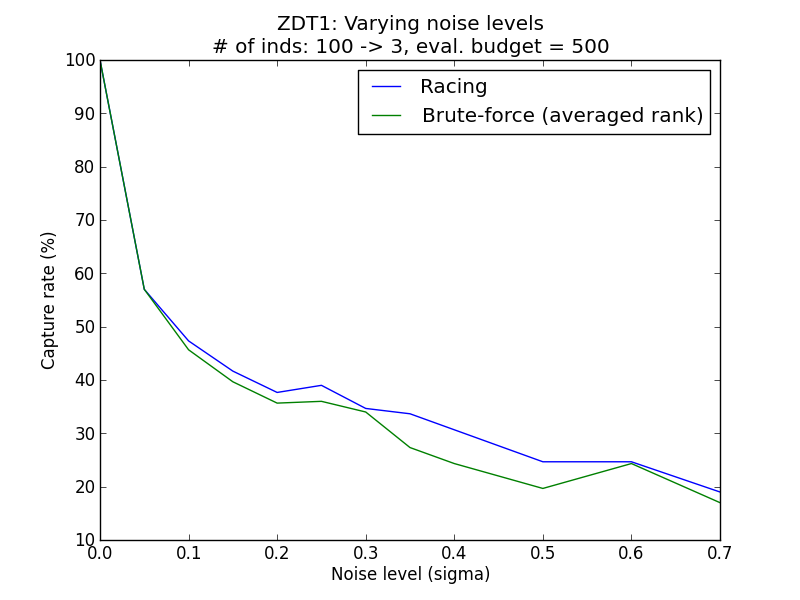
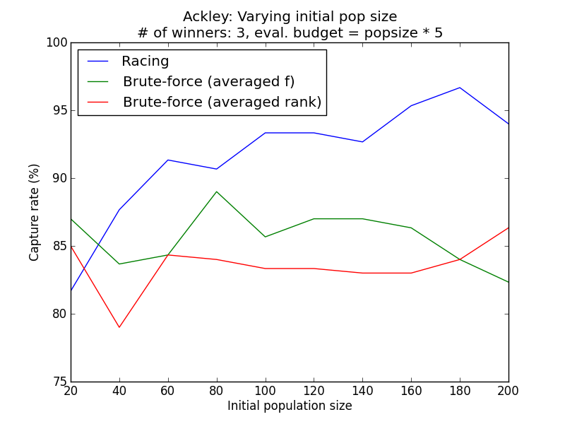
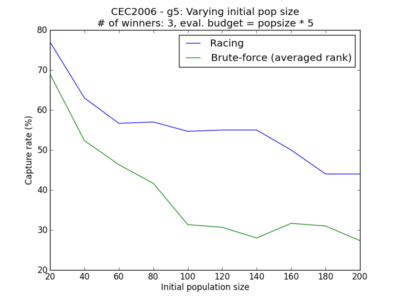
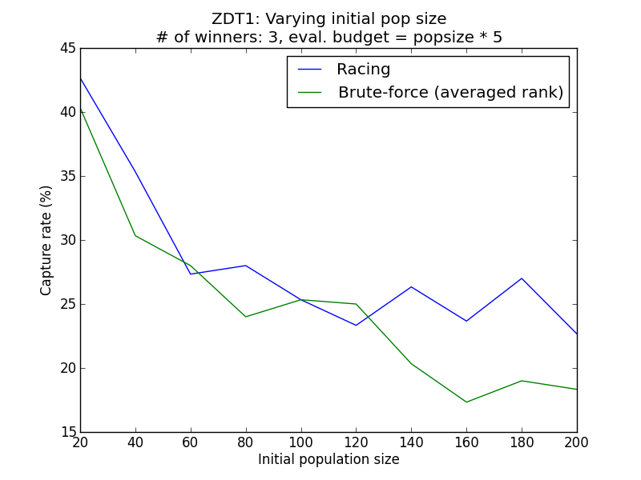
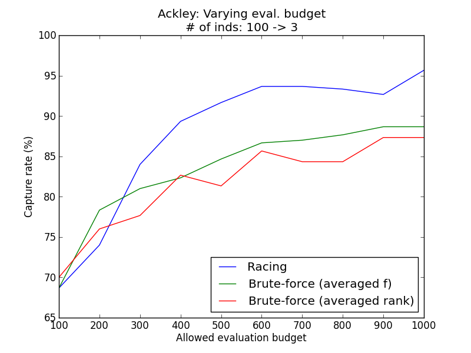
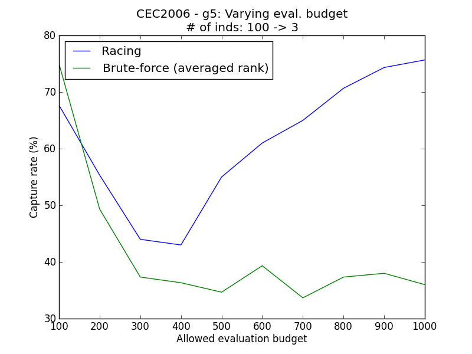
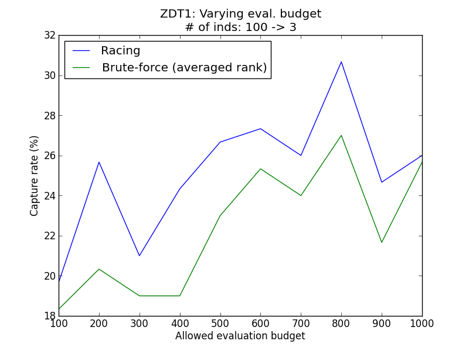

.. _tutorial7:

=======================================================================
Tutorial 7: Racing the individuals in stochastic optimization problems
=======================================================================

Background
##########

When trying to solve a stochastic optimization problem, an algorithm will
have to handle the stochasticity in order to obtain the true optimal solution.
During the optimization process of a population based algorithm,
it is often required to identify which individuals are more superior than the
others, for example in the environmental selection process of SGA,
neighbourhood information update of PSO, and so on. In this tutorial we will
introduce the method of racing which tries to achieve the task efficiently.
Our main goal is **to reconstruct the full ordering among the individuals
by their true performance**. The main obstacle is that we can only observe
the non-determinstic performance of each individual, whose ground truth is
distorted by the stochasticity of the problem. A direct consequence of this
goal is the ability to extract N top performing individuals among a pool of
them, which can be a very useful information for an optimization algorithm.

Racing with PyGMO
#################

Racing is a mechanism based on statistical testing, and the main idea is that
an individual can be dropped immediately once statistical significance evidence
is present, so that we do not waste unnecessary objective function evaluation
on these clearly inferior individuals. This way, the other individuals whose
performance are not obviously good or bad will be evaluated more frequently --
possibly yielding a better accuracy.

In this tutorial we will look at a special class of stochastic problems -- the
noisy problems. We will use Ackley as the base (noise-less) problem. To race the
individuals in the population, we can simply do:

.. code-block:: python

   In [1]: from PyGMO import *
   In [2]: prob = problem.noisy(problem.ackley())
   In [3]: pop = population(prob, 10)
   In [4]: winners = pop.race(1)

which will extract a single winner. There are some other parameters which can
be adjusted, for example:

.. code-block:: python
   
   In [5]: winners = pop.race(3, 10, 200, 0.01)

will race until 3 individuals remain, evaluate at the start every individuals for
at least 10 times, with an objective function evaluation budget of 200 times and
perform statistical testing at the confidence level of 0.01. You can even provide
a list of indices to specify a subset of individuals to be raced, for example:

.. code-block:: python

    In [6]: winners = pop.race(1, 10, 200, 0.01, [0,1,2,3,4])

will return the best individual among the first five individuals in the population.

Why racing: A comparative study
###############################

Racing does not magically identify the winners -- it still requires that additional
function evaluation be performed. One may ask: why should one use racing, when there
is a simpler approach of simply evaluating each individual multiple times equally?
In the following we try to answer this question by justiying the use of racing.

Assume that we have a limited amount of objective evaluation budget, and that we want
to extract the best few individuals from a population. The following are the possible
approaches that we could use:

* **Brute-force by fitness**: Evaluate all individuals an equal number of times and record
  the average of their fitness values. Identify the best few individuals using the sorted
  averaged fitness values. Note that this method is only applicable for use in
  unconstrained, single-objective problems.

* **Brute-force by ranks**: Similar to the above, but replace the raw fitness values to a
  nominal relative ranking. This can be done by using the built-in ``get_best_idx()``
  function in ``population`` class. This method is thus able to handle constrained
  or multi-objective problems.

* **Racing**: This is similar to the brute-force by ranks method, except that the
  computational budget for function evaluation is more cleverly distributed among
  different individuals.

To quantitatively measure the peformance of each method, we define a notion called
*capture rate*: the degree of overlapping between the ground truth winners and the
estimated winners from a particular method (brute-force rank / brute-force fitness
/ racing). Note that we can artificially construct the population and stochastic
problem, so that the ground truth is always known beforehand to us for the purpose
of such an analysis.

We set up a few configurations and plot the capture rates for different methods,
averaged over 100 independent trials. The default strength of the noise is normally
distributed, having a zero mean and a standard deviation of 0.5. Please refer to
``simple_racing.py`` contained in PaGMO source directory for more details.

Varying noise level
-------------------

Problems considered: Ackley (Single objective), CEC2006-g5 (Constrained single objective), ZDT1 (Multi-objective)

Varying initial population sizes
---------------------------------

Problems considered: Ackley (Single objective), CEC2006-g5 (Constrained single objective), ZDT1 (Multi-objective)

Varying evaluation budget 
-------------------------

Problems considered: Ackley (Single objective), CEC2006-g5 (Constrained single objective), ZDT1 (Multi-objective)

Generally, it is observed that the racing method yields higher capture rates
than the simple methods. The simulation results above demonstrate empirically
how racing could improve the ability to reconstruct the correct ordering of the
individuals in face of a stochastic environment.
