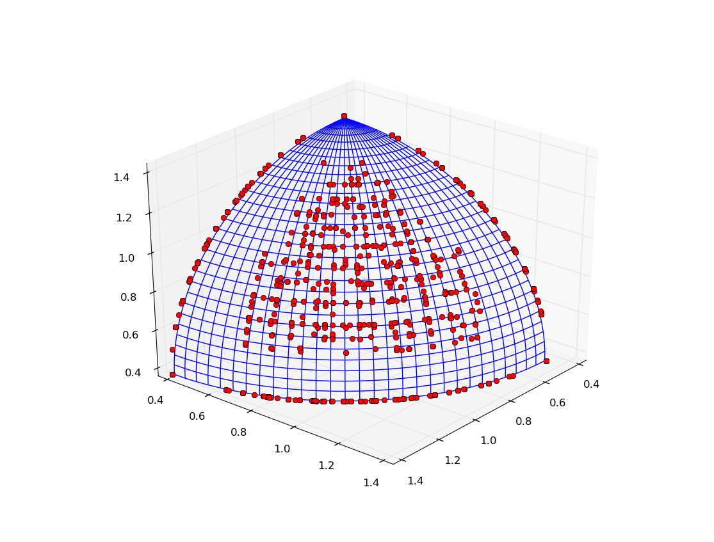
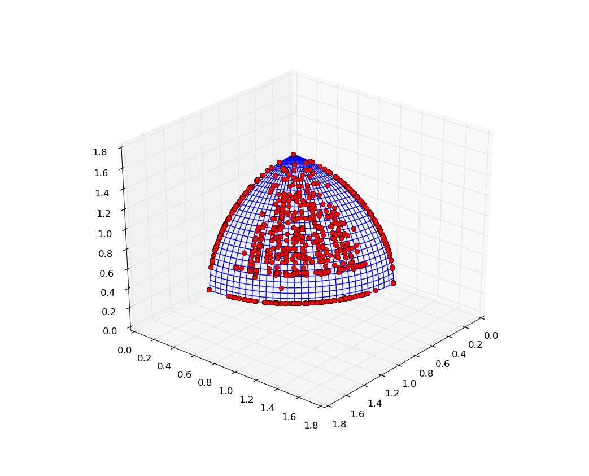

.. _using_hypervolumes_in_your_algorithm:

================================================================
Using hypervolumes in your own algorithm
================================================================

In this tutorial we will show how to use the hypervolume features in your own custom evolutionary algorithms.
If you haven't already, we suggest getting familiar with the tutorial :ref:`adding_a_new_algorithm`.

As it is often the case in the tutorials, we will present a fairly simple MOO algorithm, which we would not expect to be particularly good.

.. code-block:: python

  from PyGMO import *
  from PyGMO.util import *
  import random

  class my_hv_moo_alg(algorithm.base):
     """
     A custom steady-state algorithm, based on the hypervolume computation.
     """
  
     def __init__(self, gen = 10, p_m = 0.02):
        """
        Constructs an instance of the algorithm.
  
        USAGE: my_hv_moo_alg(gen=10, p_m=0.02)
  
        NOTE: Evolves the population using the least contributor feature.
  
        * gen: number of generations
        * p_m: probability of mutation
        """
        # We start by calling the base constructor
        super(my_hv_moo_alg,self).__init__()
        # Store the number of generations
        self.__gen = gen
        self.__p_m = p_m
  
     # Performs a very simple crossover step
     def cross(self, ind1, ind2):
        x1 = ind1.cur_x
        x2 = ind2.cur_x
        return tuple(random.choice((x1[i], x2[i],)) for i in xrange(len(x1)))
  
     # Gaussian mutation
     def mutate(self, x, lb, ub):
  
        # Implementation of the Gaussian operator
        def _g_op(i):
           return min(max(random.gauss(x[i], (ub[i]-lb[i]) * 0.1), lb[i]), ub[i])
  
        # Condition for the mutation to happen
        def _rnd_mut():
           return random.random() < self.__p_m
  
        return tuple(_g_op(i) if _rnd_mut() else x[i] for i in xrange(len(x)))
  
     # Evolve method
     def evolve(self, pop):
        #If the population is empty (i.e. no individuals) nothing happens
        if len(pop) == 0:
             return pop
  
        #The algorithm now starts manipulating the population
        prob = pop.problem
        lb, ub = prob.lb, prob.ub
        for s in range(self.__gen):
           # Initiate new individual by a crossover of two random individuals
           idx1 = random.randint(0, len(pop) - 1)
           idx2 = (idx1 + random.randint(0, len(pop) - 2)) % len(pop)
           ind1 = pop[idx1]
           ind2 = pop[idx2]
  
           new_x = self.mutate(self.cross(ind1, ind2), lb, ub)
           pop.push_back(new_x)
  
           # Remove the least contributor
           hv = hypervolume(pop)
           ref_point = hv.get_nadir_point(1.0)
           lc_idx = hv.least_contributor(ref_point)
  
           pop.erase(lc_idx)
        return pop
  
     def get_name(self):
           return "Custom HV-based MOO"

  def main():
     prob = problem.dtlz(2)
     alg = my_hv_moo_alg(gen = 100, p_m=0.02)
     pop = population(prob, 100)
     # Establish a constant reference point, so the increase is noticed
     ref_point = (3000,) * 3
     for _ in xrange(100):
        pop = alg.evolve(pop)
        print "P-Distance: %.5f, Hypervolume: %.5f" % (prob.p_distance(pop), hypervolume(pop).compute(ref_point))
     prob.plot(pop)

  if __name__ == "__main__":
     main()

You can copy the whole code above and save it as a python script (e.g. **my_alg.py**), this way you can execute it yourself by issuing the following in the command line: **python my_alg.py**.

The algorithm does the following in the *evolve* method:

#. Establish a new individual by performing a very simple crossover on two random individuals
#. Apply the Gaussian mutation operator
#. Push the newly obtained vector to the population
#. Establish the least contributor using the `PyGMO.util.hypervolume` object
#. Remove the least contributor from the population

Script above should produce an output similar to the one below:

.. code-block:: bash

  P-Distance: 0.77281, Hypervolume: 26999518559.47130
  P-Distance: 0.66491, Hypervolume: 26999704053.34119
  P-Distance: 0.51330, Hypervolume: 26999704183.90998
  .
  .
  .
  P-Distance: 0.00026, Hypervolume: 26999999999.42529
  P-Distance: 0.00026, Hypervolume: 26999999999.42529
  P-Distance: 0.00024, Hypervolume: 26999999999.42531

We can observe an improvement over the consecutive generations both in the distance to the Pareto front (P-Distance) and the hypervolume indicator itself.
The result of the script should be a plot similar to the one below:

Custom algorithms can also be used in the archipelago evolution.
For this, we will employ the information from the previous tutorial :ref:`migration_based_on_hypervolumes`. Substitute the ``main()`` method in the script above with the following experiment, which will initiate an archipelago with our custom algorithm on-board.

.. code-block:: python

  def main():
     prob = problem.dtlz(2)
     alg = my_hv_moo_alg(gen = 100, p_m=0.02)
  
     # Initiate the migration policies
     s_pol = migration.hv_best_s_policy(0.1, migration.rate_type.fractional)
     r_pol = migration.hv_fair_r_policy(0.1, migration.rate_type.fractional)
  
     # Set up the archipelago
     n_islands = 16
     n_individuals = 64
     arch = archipelago(topology=topology.fully_connected())
     islands = [island(alg, prob, n_individuals, s_policy=s_pol, r_policy=r_pol) for i in xrange(n_islands)]
     for i in islands:
        arch.push_back(i)
  
     # Evolve
     n_steps = 20
     for s in xrange(n_steps):
        print "Evolving archipelago, step %d/%d" % (s, n_steps)
        arch.evolve(1)
  
     # Merge all populations across the islands together
     pop = population(prob)
     for isl in arch:
        for ind in isl.population:
           pop.push_back(ind.cur_x)
  
     print "Final P-Distance: ", prob.p_distance(pop)
     prob.plot(pop)

The execution of the script should result in a plot similar to the one below:

